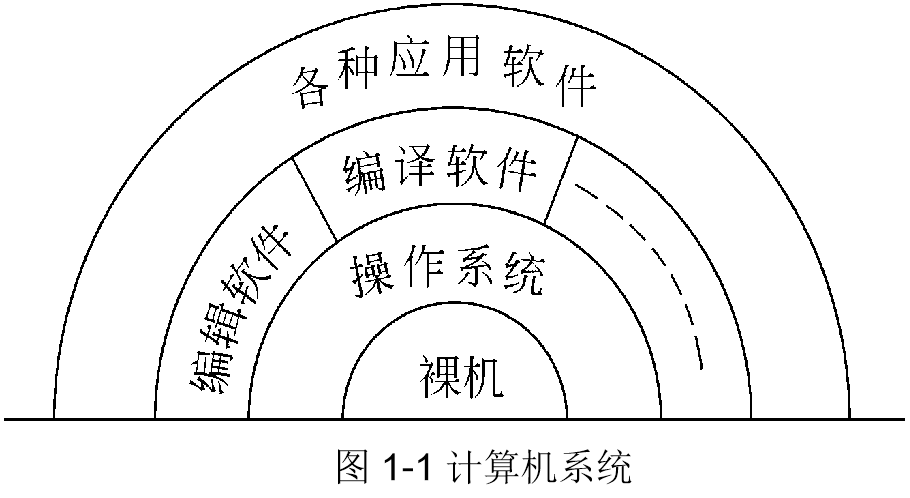
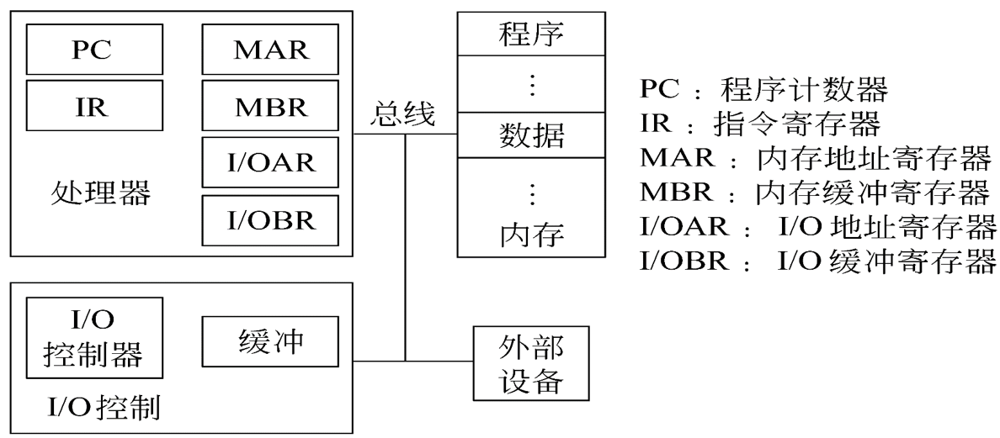
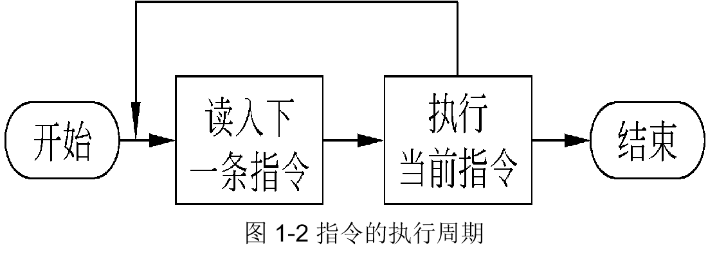
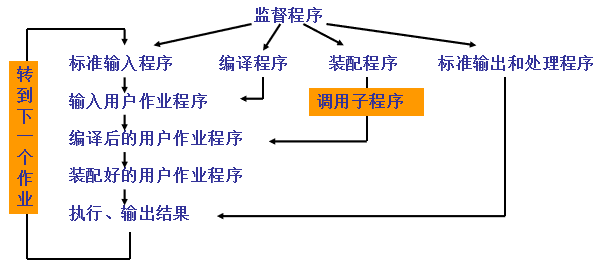

# 第一章 绪论

## 目录

- 1.1  操作系统概念
- 1.2  操作系统的历史
- 1.3  操作系统的基本类型
- 1.4  操作系统功能
- 1.5  研究操作系统的几种观点

## 教学目的

1. 掌握操作系统的概念和特点
2. 掌握操作系统的类型
3. 掌握操作系统的主要功能
4. 了解操作系统的发展历史
5. 了解操作系统的体系结构和系统机制

## 1.1  操作系统概念

### 一. 计算机系统



#### 1）计算机硬件简介

    

#### 2）指令的执行与中断

##### （1）指令的执行周期



##### （2） 中断

系统对外部事件的处理采用异步方式，这样的目的是提高系统的运行效率。但是系统如何获取外部事件进行处理这就是中断技术。

- 中断执行过程

- 带有中断的指令执行周期


### 二.虚拟机（Virtual machine）

安装了操作系统的计算机，已经不再是一台裸机，而是一台功能更强、使用更为方便的机器，称为虚拟机或扩展机（Extended machine）。

**引入操作系统的目的**


### 三.操作系统的定义

操作系统是计算机系统的一个系统软件，它是这样一些程序模块的集合——它们管理和控制计算机系统中的硬件及软件资源，合理地组织计算机工作流程，以便有效地利用这些资源为用户提供一个具有足够的功能、使用方便、可扩展、安全和可管理的工作环境，从而在计算机与其用户之间起到接口的作用。

### 三.操作系统的特点

1. 是最底层的系统软件。
2. 为用户提供友好的接口和必需的服务。
3. 合理组织计算机的工作流程。
4. 为用户共享系统软硬件资源提供条件。
5. 保证系统的可靠性、安全性、可用性和可管理性。

## 1.2  操作系统的历史

### 一.手工操作阶段

#### 1.处理过程

操作系统本身不自我运行，等待操作人员输入命令，然后启动相应的计算，等待服务结束后，计算机又处在等待状态。

#### 2.特点

- 用户独占资源
- 人工干预较多（浪费处理机时间）
- 计算时间拉长,效率低

### 二.批处理系统阶段

#### 1. 联机I/O批处理阶段


>缺点:I/O设备和CPU仍然串行工作，CPU时间浪费相当大。

#### 2. 脱机I/O批处理阶段


#### 3. 监督程序阶段



#### 4. 执行系统阶段（Executive system）

通道是一种专用的处理部件，能控制一台或多台I/O设备同时工作，负责I/O设备与主存之间的信息传输。

中断是指当主机接到外部信号时，马上停止原来工作，转去处理这一事件，处理完毕后，主机回到原断点处继续执行。

在通道和中断技术的帮助下，扩充了监督程序，使其具有作业运行自动调度和输入输出控制的能力。实现了主机和通道、主机和输入输出设备的并行操作。

### 多道程序系统(Multiprogramming)


#### 1. 主要特征

- （1）多用户脱机使用计算机
- （2）成批处理
- （3）多道程序运行
- （4）宏观上并行
- （5）微观上串行

#### 2. 特点

- 多道：多个相互独立的程序同时存在于主存中
- 并发：不同设备形成并行，同一设备形成串行
- 共享：提供并发的基础

#### 3. 多重处理系统（Multiprocessing）

是指系统配备了多个CPU，从而能真正实现并行。

### 四.分时/实时操作系统阶段

#### 1. 分时操作系统

系统将处理机的时间划分为小的时间间隔（又称时间片），轮流地为每个终端上的作业服务，使每个用户都感觉好象自己在使用计算机。

#### 2. 分时系统的特点

- （1）交互性（动态运行控制，软件开发调试方便，提交作业方便，用户之间合作方便。）
- （2）多用户同时性
- （3）独立性

#### 3. 实时操作系统

系统是以在允许时间范围之内做出响应为特征的，它是另一类联机的操作系统。

- 开始截止时间
- 完成截止时间

#### 4. 实时系统的设计问题及特点

- （1）实时时钟管理（定时处理和延时处理）
- （2）连续的人机对话
- （3）过载保护
- （4）高度可靠性和安全性

### 五.通用操作系统阶段

同时兼有多道批处理、分时、实时处理的功能，或具有其中两种以上的功能系统，称为通用操作系统。

**多道和分时系统的出现，标志着现代操作系统的正式形成。**

### 六.操作系统的发展阶段

- PC机操作系统：Windows系列
- 嵌入式操作系统：Linux/Win CE
- 网络操作系统：Netware
- 分布式操作系统
- 智能化操作系统

## 1.3  操作系统的基本类型

1. 批处理操作系统（Batch Processing Operating System）
2. 分时操作系统（Time Sharing Operating System）
3. 实时操作系统（Real Time Operating System）
4. 个人计算机操作系统（Personal Computer Operating System）
5. 网络操作系统（Network Operating System）
6. 分布式操作系统（Distributed Operating System）

## 1.4  操作系统功能

### 一. 处理机管理

主要研究在多道程序的情况下，处理机的分配调度策略、分配实施和资源回收的问题。

### 二. 存储管理

研究以下问题：

- 内存分配
- 存储保护
- 内存扩充

### 三.  设备管理

研究以下问题：

- 设备的分配和管理
- 设备的独立性

### 四.  信息管理（文件管理）

研究以下问题：

- 外存储空间的管理
- 目录管理
- 文件的读/写管理
- 存储控制
- 共享
- 安全（保密/保护）

### 五.  用户接口

- 程序级（系统调用）：提供一组广义指令供用户程序调用。
- 作业级（命令接口）：提供一组控制操作指令供用户去组织、控制自己的作业执行。

## 1.5  研究操作系统的几种观点

### 一.  资源管理者

操作系统是用来管理和控制计算机系统全部资源的程序集合。由5大功能。

### 二. 用户界面的观点

用户关心如何使用操作系统提供的界面来操作控制计算机。

### 三.  进程管理观点

- 通过进程这一动态的概念，揭示操作系统动态的特点。
- 如何提高系统的效率，并发/并行的执行方式，这些的体现就是以“进程”为独立的个体进行调度和资源分配的。

## 附录 算法描述

### 一.  算法的开始与结束

    ```txt
begin

end
    ```

### 二.  repeat循环

    ```
repeat
        操作体
until   条件
    ```

>条件不成立时循环

三.  if 条件控制

    ```txt
    if  条件
    then  
      操作
    else
      操作
    fi
    ```

### 四.  并发程序设计的框架

定义共享量；

    ```text
        main(){
        cobegin{
           process_1();
           process_2();
           ……
    }coend
    }
```

>（*引自2009全国研究生入学考纲）

## 作 业

习题 1.1，1.2

思考题 1.4，1.6
