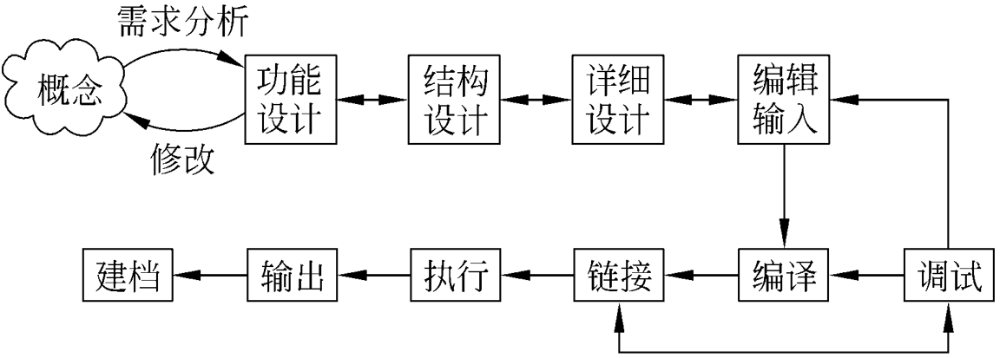
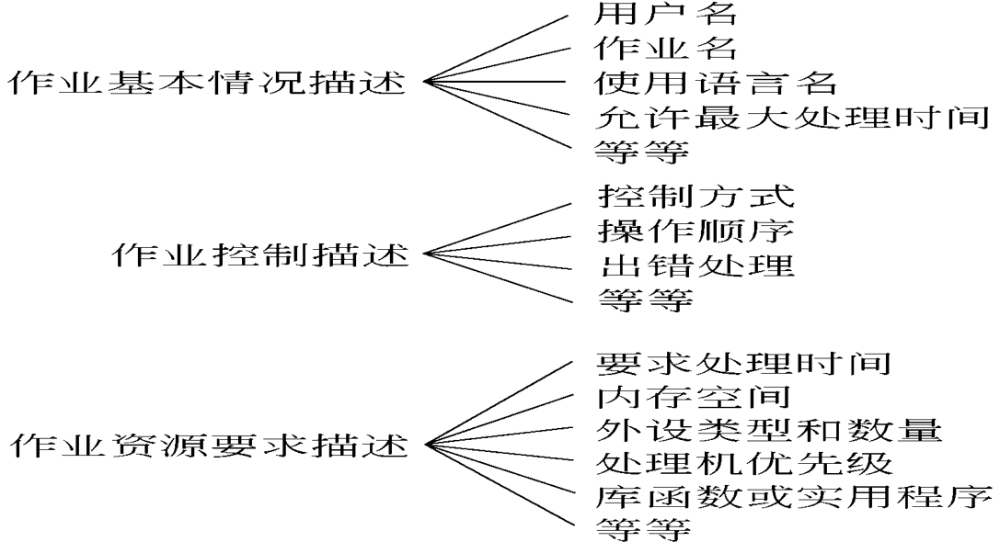
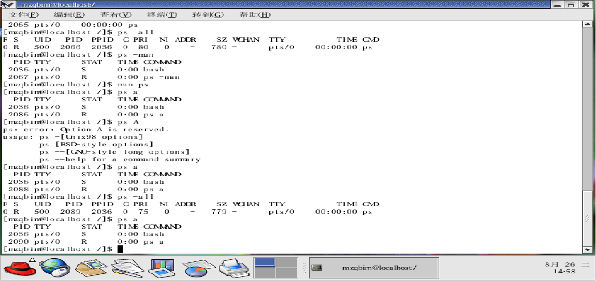

# 操作系统用户界面

## 目录

- 2.1  简介
- 2.2  一般用户的输入输出界面
- 2.3  命令控制界面
- 2.4  Linux和Windows的命令控制界面
- 2.5  系统调用
- 2.6  Linux和Windows的系统调用

## 教学目的

1. 掌握作业的概念
2. 理解用户的输入/输出界面
3. 掌握Linux和Windows的命令控制界面
4. 掌握Linux和Windows的系统调用

## 2.1 简介

用户界面负责用户和操作系统之间的交互：

- 用户通过用户界面向计算机系统提交服务需求
- 计算机通过用户界面向用户提供用户所需要的服务

### 一.用户分类

#### 1）使用/管理计算机应用程序的用户

- 普通用户
- 管理员用户

操作系统为普通用户和管理员用户提供的界面由一组不同形式表示的操作命令组成，每个命令实现和完成用户所要求的特定功能和服务。

#### 2）程序开发人员

程序开发人员使用操作系统所提供的编程功能开发新的应用程序，完成用户所要求的服务。

- 针对不同的用户，操作系统提供不同的用户界面。普通用户和管理员用户的界面是一组不同操作命令的集合，它们分别实现用户所要求的不同功能，为用户提供相应的服务。

- 对编程人员提供的是一组系统调用的集合，这些系统调用允许编程人员使用操作系统和程序，开发能够满足用户服务需求的新的控制命令。

### 二.作业的定义

#### 1）引入

#### 2）作业的定义

在一次应用业务处理过程中，从输入开始到输出结束，用户要求计算机所做的有关该次业务处理的全部工作。

#### 3）作业步

作业步是在一个作业的处理过程中计算机所做的相对独立的工作。

### 二. 作业的组成

由程序、数据和作业说明书组成。一个作业在系统中体现的标志是JCB(Job Control Block)

#### 1）说明书

包含基本描述、控制描述和资源要求描述。

如下图所示。

## 2.2  一般用户的输入/输出方式

### 一.  联机输入/输出方式

常用于交互式系统中，设备与主机直接相连。

### 二. 脱机输入/输出方式

利用卫星机进行输入/输出，然后将其存储的数据整体一次性输入主机存储设备中进行运行。

### 三.  直接耦合方式

就是把主机和卫星机通过一个公用的大容量外存直接耦合起来，卫星机仍完成低速的输入/输出过程，主机从外存直接读取数据进行处理。

### 四.  SPOOLING系统

### 五.  网络联机方式

就是通过网络中的一台设备对网络中的另一台设备进行的输入/输出。

## 2.3  命令控制界面

命令控制是操作系统提供给用户的一种接口，用户通过该界面进行作业的组织和运行。

### 一.  命令对作业的控制方式

#### 1）脱机方式

系统通过作业说明书，对作业进行控制处理，执行过程用户无法干预。

脱机方式的命令

提供一组控制操作指令供用户去组织、控制自己的作业执行。

- Windows 的批处理程序
- Linux 的Shell程序

#### 2）联机方式

用户直接输入操作系统提供的命令，对作业的执行和计算机资源进行管理。

联机方式的命令

- 环境设置
- 执行权限管理
- 系统管理
- 文件管理
- 程序的编辑、编译、链接装配
- 通信
- 资源要求

### 二.  命令控制界面

#### 1）Linux命令控制界面

##### （1）命令-who

##### （2）命令-ps

##### （3）命令-ls

#### 2）Windows命令控制界面

直接在命令控制下操作，转cmd。

## 2.4 系统调用

是操作系统提供给程序员唯一的接口。编程人员利用系统调用，在源程序一级动态请求和释放系统资源，调用系统中已有的系统功能来完成那些与机器硬件部分相关的工作以及控制程序的执行速度。

系统调用对用户屏蔽了操作系统的具体动作而只提供有关的功能。命令控制界面也是在系统调用的基础上开发而成的。

不同的系统提供有不同的系统调用。

### 一.  系统调用分类

- 设备管理
- 文件管理
- 进程控制
- 进程通信
- 存储管理
- 线程管理

要提供系统调用功能，操作系统必须有实现这些功能的子程序或过程。为了保证操作系统程序不被用户程序破坏，不允许用户程序直接访问操作系统的系统程序和数据。

**编程人员如何调用操作系统内部的程序和数据呢？**

这需要有一个类似于硬件中断处理的处理机制。当用户使用系统调用时，产生一条相应的指令，处理机在执行到该指令时发生相应的中断，并发出有关信号给该处理机制。该处理机制在收到了处理机发来的信号后，启动相关的处理程序去完成该系统调用所要求的功能。

### 二.  系统调用原理

#### 1）陷阱（trap）处理机构

在系统中为控制系统调用服务的机构。

**陷阱指令（访管指令）：是指系统调用引起处理机中断的指令。**

**模式切换：完成用户模式（用户态）向系统模式的切换（系统态）。**

每个系统调用都对应一个事先给定的功能号。在陷阱指令中必须包括对应系统调用的功能号，还可带有传递给陷阱处理机构和内部处理程序的有关参数。

为了实现系统调用，还必须为实现各种系统调用功能的子程序编造入口地址表，每个入口地址都与相应的系统子程序名对应起来。然后，由陷阱处理程序把陷阱指令中所包含的功能号与该入口地址表中的有关项对应起来，从而由系统调用功能号驱动有关系统子程序执行。

#### 2）系统调用处理过程

不同的系统调用需要传递给系统子程序以不同的参数。

一种是由陷阱指令自带参数。

另一种是通过通用寄存器来传递参数。

如果传递的参数较多，还可在内存中开辟专用堆栈区来传递参数。

### 三.  Linux系统调用实例

Read源码（Linux2.4.0）

## 作业

习题    2.2，2.5，2.7，2.9

思考题  2.3，2.6，2.8，2.10，2.11
