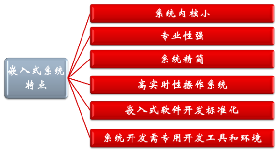
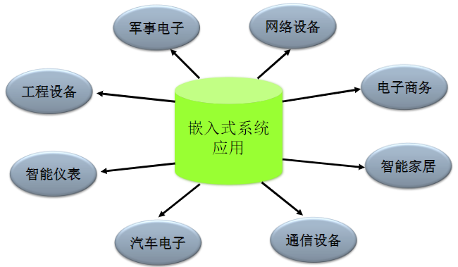
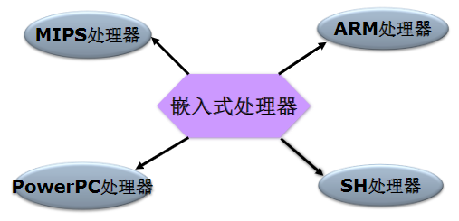
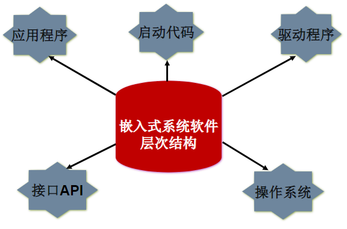
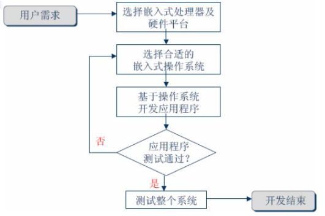

# 第1章、嵌入式软件开发概述

1. 嵌入式系统概述
2. 嵌入式系统的基本结构
3. 嵌入式系统开发

## 1. 嵌入式系统概述

### 1.1 什么是嵌入式系统？

嵌入式系统是**以应用为中心**，以计算机技术为基础，
且**软硬件可裁减**，适应应用系统对功能、可靠性、
成本、体积、功耗有严格要求的**专用计算机系统**。
它一般由以下几部分组成:

- 嵌入式微处理器
- 外围硬件设备
- 嵌入式操作系统
- 特定的应用程序

### 1.2 嵌入式系统的特点

### 1.3嵌入式系统的应用领域

### 1.4 与单片机、PC的不同

- 嵌入式系统单片机
  - 嵌入式系统的主流是以32位嵌入式微处理器为核心的硬件设计和基于实时操作系统（RTOS）的软件设计
  - 单片机系统多为4位、8位、16位机，不适合运行操作系统，难以进行复杂的运算及处理功能
  - 嵌入式系统设计的核心是软件设计（占70%左右的工作量），单片机系统软硬件设计所占比例基本相同
  - 嵌入式系统一般是专用系统，而PC是通用计算平台
  - 嵌入式系统的资源比PC少得多
  - 嵌入式系统软件故障带来的后果比PC机大得多
  - 嵌入式系统一般采用实时操作系统
  - 嵌入式系统大都有成本、功耗的要求
  - 嵌入式系统得到多种微处理体系的支持
  - 嵌入式系统需要专用的开发工具

### 1.5 嵌入式系统的未来

- 巨大的市场
  - 嵌入式产品的巨大商机－－全过程自动化产品制造、大范围电子商务活动、高度协同科学实验以及现代化家庭起居。
  - 你接触的每一样东西将装有芯片和嵌入式软件。
- 创新的机遇
  - 嵌入式系统与技术是一个分散的工业，充满竞争、机遇与创新
  - 没有哪一个系列的处理器和操作系统能够垄断全部市场，即便在体系结构上存在着主流，但各不相同的应用领域决定了不可能有少数公司，少数产品垄断全部市场。因此嵌入式系统领域的产品和技术，必然是高度分散的，留给各个行业的中小规模高技术公司的创新余地很大。

## 2.嵌入式系统的基本结构

- 嵌入式系统的构架
- 嵌入式微处理器
- 嵌入式系统外设与接口
- 嵌入式系统软件层次结构
- 嵌入式操作系统

### 2.1 嵌入式系统架构

### 2.2 嵌入式微处理器

### 2.3 嵌入式系统外设与接口

### 2.4 嵌入式系统软件层次结构

硬件上执行的软件层次：

2.5 嵌入式操作系统

- 嵌入式操作系统是嵌入式应用软件的基础和开发平台。嵌入式系统的出现，解决了嵌入式软件开发标准化的难题。**嵌入式系统具有操作系统的最基本的功能**:
  - 进程调度
  - 内存管理
  - 设备管理
  - 文件管理
  - 操作系统接口(API调用)
- 嵌入式操作系统具有的特点:
  - 系统可裁减,可配置.
  - 系统具备网络支持功能
  - 系统具有一定的实时性
- 几种常见的嵌入式操作系统
  - Linux操作系统
  - WinCE操作系统
  - UC/OS-II
  - VxWorks
  - palmOS
  - ......

## 3. 嵌入式系统的开发

### 3.1 嵌入式系统开发的特点

- 嵌入式系统与通用计算机系统的差别：
  - 人机交互界面
  - 有限的功能
  - 时间关键性和稳定性

- 嵌入式软件开发的特点：
  - 任何一个嵌入式产品都是**软件和硬件的结合**
  - 嵌入式产品研发完成,软件就**固化在硬件环境中**,嵌入式软件是针对相应的嵌入式硬件开发的,是专用的
  - **软件开发难度大**
    - 嵌入式应用软件对**实时性、稳定性、可靠性、抗干扰性**等性能的要求都比通用软件的要求更为严格和苛刻。

- 嵌入式系统开发常用语言：
  - 汇编语言：执行效率高，时序精确，便于调试，开发效率低
  - C语言：开发效率高，执行快，低级语言特性，库支持丰富
  - C++语言：功能强大，资源消耗大
  - Java语言：Android手机开发
  - Object-C/Swift：IOS开发
  - C#：WinPhone开发

- 嵌入式系统开发模式
  - 利用C、汇编等工具，直接在硬件上编程，一般用于硬件资源有限的场合
  - 基于某操作系统编程，用于硬件资源充裕，设备多的情况

- 嵌入式系统开发环境：
  - **交叉开发环境**：交叉开发环境是指实现编译、链接和调试应用程序代码的环境。与运行应用程序的环境不同，它分散在有通信连接的**宿主机**与**目标机**环境之中。
    - **宿主机(Host)**是一台通用计算机，一般是PC机。它通过串口或网络连接与目标机通信。
    - **目标机(Target)** 可以是嵌入式应用软件的实际运行环境，也可以是能替代实际环境的仿真系统。

### 3.2 嵌入式开发流程

### 3.3 嵌入式开发面临的挑战

- 应该使用多少硬件
- 系统设计的指标是多少
- 最小化电力的要求
- 升级考虑
- 可靠性、稳定性如何
- 完整的测试困难
- 难以观察和控制
- 开发环境苛刻
