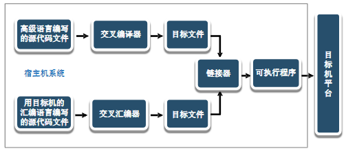
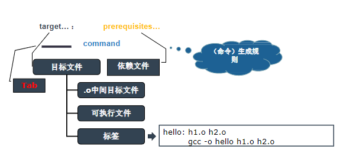
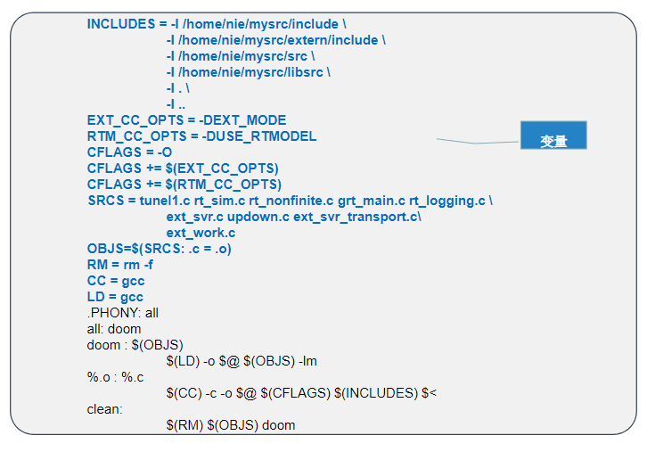
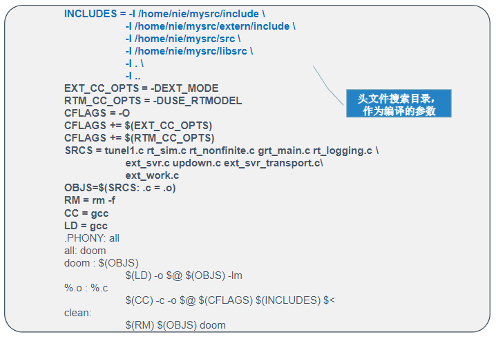
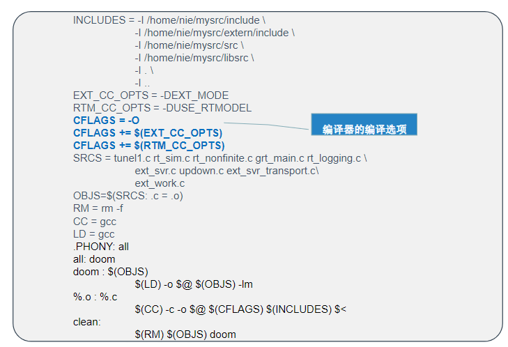
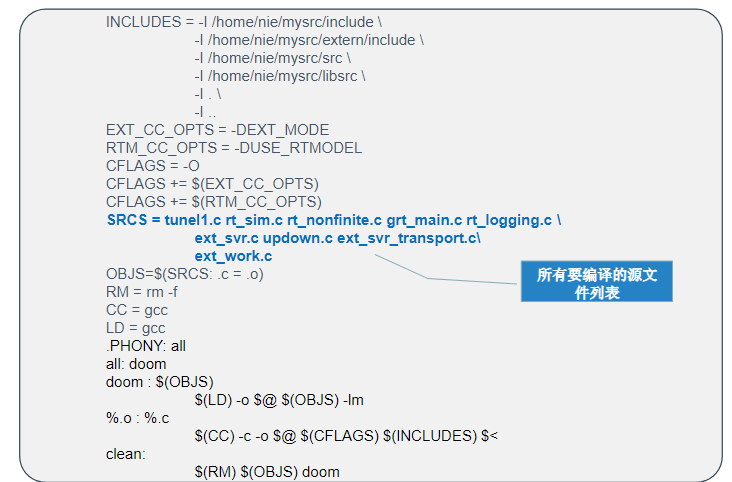
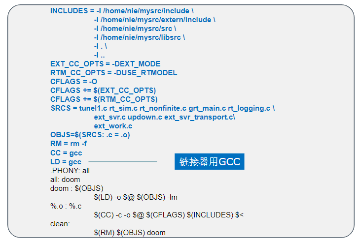

# 第3章Linux下C编程基础

- [第3章Linux下C编程基础](#第3章linux下c编程基础)
  - [3.1 GNU开发工具链](#31-gnu开发工具链)
    - [GNU工具链](#gnu工具链)
    - [GNU开发工具](#gnu开发工具)
    - [GNU Tools 开发工具组件介绍](#gnu-tools-开发工具组件介绍)
      - [GCC](#gcc)
      - [binutils](#binutils)
      - [gdb](#gdb)
      - [GNU make](#gnu-make)
      - [diff](#diff)
      - [patch](#patch)
      - [CVS](#cvs)
  - [GCC程序编译](#gcc程序编译)
    - [Gcc编译过程](#gcc编译过程)
    - [文件类型](#文件类型)
    - [基本用法](#基本用法)
      - [多个源文件程序编译（演示）](#多个源文件程序编译演示)
    - [gcc --预处理](#gcc---预处理)
    - [gcc --编译阶段](#gcc---编译阶段)
    - [gcc --汇编阶段](#gcc---汇编阶段)
    - [gcc—链接阶段](#gcc链接阶段)
    - [编译选项](#编译选项)
      - [编译选项举例](#编译选项举例)
  - [3.3 GDB程序调试(**Debug**)](#33-gdb程序调试debug)
    - [起步](#起步)
    - [GDB快速进阶](#gdb快速进阶)
    - [GDB命令](#gdb命令)
  - [3.4 Makefile工程管理](#34-makefile工程管理)
    - [makefile认识](#makefile认识)
    - [Makefile工作原理分析](#makefile工作原理分析)
    - [Makefile文件编写规则](#makefile文件编写规则)
      - [目标](#目标)
      - [伪目标](#伪目标)
    - [Makefile实例分析](#makefile实例分析)
      - [使用变量](#使用变量)
      - [在makefile中使用变量](#在makefile中使用变量)
      - [让make自动推导依赖关系](#让make自动推导依赖关系)
      - [makefile进一步简化](#makefile进一步简化)
      - [隐含规则](#隐含规则)
      - [同时生成多个可执行文件](#同时生成多个可执行文件)
      - [命令出错](#命令出错)
      - [其他变量](#其他变量)
      - [环境变量](#环境变量)
      - [自动化变量](#自动化变量)
      - [预定义变量](#预定义变量)
      - [综合实例](#综合实例)

## 3.1 GNU开发工具链

嵌入式系统软件开发流程：



### GNU工具链

- GNU Tools：全称（GNU Development Toolchains）
- GNU Tools交叉开发环境：全称（GNU Cross-PlateformDevelopment Toolchains）
- GNU既支持本地程序开发，又支持交叉编译

### GNU开发工具

- 自由软件
- 完备的工具链：GCC、binutils、gdb、GNU make、patch、CVS 、
- 开发库
- 命令行方式：使用稍复杂、功能强大

下载：[www.gnu.org](www.gnu.org)

GNU Tools是Linux环境下最主要的开发工具集，主要有以下几个部分：

- 编译开发工具：把源程序编译为可执行文件，如gcc。
- 调试工具：对可执行程序进行源码或汇编级调试的软件，如gdb。
- 软件工程工具：用于协助多人开发或大型软件项目管理的软件，如make等。

### GNU Tools 开发工具组件介绍

#### GCC

（GNU Compiler Collection）：支持C、C++、ADA、Java、Fortran、PASCAL等语言

主要包括：

- cpp：GNU C编译器的预处理器。
- gcc：符合ISO标准的C编译器。
- g++：基本符合ISO标准的C++编译器。
- gcj：GCC的java前端。
- gnat：GCC的GNU ADA 95的前端。

#### binutils

是一组二进制工具程序集合，是辅助GCC的主要软件。

主要包括：

- as：GNU汇编器
- ld：GNU链接器
- ar：创建归档文件，以及制作静态库的工具
- nm：列出目标文件中的符号
- objcopy：复制和转化obj文件
- objdump：显示对象文件的信息
- readelf：显示elf格式执行文件中的各种信息
- size：显示目标文件和可执行文件各段的大小
- strings：显示文件中可以打印的字符
- strip：去掉可执行文件中多余的信息（如调试信息）

#### gdb

GNU调试器。可以用来调试C、C++和其他语言编写的程序。如加一些图形前端（如DDD），可以在图
形环境下调试程序。

#### GNU make

是一个用来控制可执行程序生成过程的程序。它允许用户生成和安装软件包，而无需了解生成、安装软件包的过程。

#### diff

比较文本差异的工具，也可以用来生成补丁。

#### patch

补丁安装程序，可根据diff生成的补丁来更新程序

#### CVS

版本控制系统，用于管理发行版本和控制在多位作者间同时编辑源文件。

## GCC程序编译

Gcc编译器能将C、C++语言源程序、汇编程序编译、链接成可执行文件。在Linux系统中，可执行文件没有统一的后缀，系统从文件的属性来区分可执行文件和不可执行文件。

- gcc又是一个交叉平台编译器，它能够在当前CPU平台上为多种不同体系结构的硬件平台开发软件，因此**尤其适合在嵌入式领域的开发编译**。
- gcc与g++：当程序中出现`using namespace std`等带有C++特性的语句时，如果用gcc编译，必须显式指明这个程序要用C++标准库编译，而**g++可以直接编译**。
- gcc可以在多种硬件平台上编译出可执行程序，其执行效率与一般的编译器相比平均效率要高20%-30%。
  - gcc编译后   `4.6k`
  - tc++3编译后 `7.8k`
  - bc45编译后  `53.8k`
  - vc6编译后   `184k`

### Gcc编译过程

Gcc编译程序时，编译过程可以被细分为四个阶段：

- 预处理(Pre-Processing)
- 编译(Compiling)
- 汇编(Assembling)
- 链接(Linking


### 文件类型

- Gcc通过后缀来区别输入文件的类别：
- `.c`为后缀的文件：C语言源代码文件
- `.a`为后缀的文件：是由目标文件构成的库文件
- `.C`、`.cc`或`.cxx`为后缀：C++源代码文件
- `.h`为后缀的文件：头文件
- `.i`为后缀的文件：是已经预处理过的C源代码文件
- `.ii`为后缀的文件：是已经预处理过的C++源代码文件
- `.o`为后缀的文件：是编译后的目标文件
- `.s`为后缀的文件：是汇编语言源代码文件
- `.S`为后缀的文件：是经过预编译的汇编语言源代码文件

### 基本用法

• Gcc最基本的用法是：

gcc [选项] 要编译的文件[选项] [目标文件]

目标文件可以缺省，默认生成的可执行文件命名为：a.out

- gcc编译选项大约有100多个，其中多数我们不常用，这里介绍其中最基本、最常用的参数。
  - 总体选项
  - 告警选项
  - 优化选项
  - 体系结构相关选项
  - 选项由-和字母组成，如`-c`、`-o`等。

起步（演示）

```c
//hello.c
#include <stdio.h>
int main(){
    printf(“hello world\n”);
    return 0;
}
```

```bash
编译和运行程序：
#gcc hello.c –o hello
#./hello
```

>输出：hello world

#### 多个源文件程序编译（演示）

编译和运行程序：

```bash
#gcc mul1.c mul2.c –o m.out
```

用一条gcc命令编译多源文件程序的缺点：**每个文件都要重新编译**

### gcc --预处理

- 在该阶段，对包含的头文件（`#include`）和宏定义（`#define`、`#ifdef`等）进行处理。可以使用gcc的选项“`-E`” 让gcc在预处理结束后停止编译过程。

```bash
[root@localhost gcc]# gcc –E hello.c –o hello.i
```

```c
/* hello.i */
......
typedef int (*__gconv_trans_fct) (struct __gconv_step *,
    struct __gconv_step_data *, void *,
    __const unsigned char *,
    __const unsigned char **,
    __const unsigned char *, unsigned char **,
    size_t *);
......
# 2 "hello.c" 2
int main(){
    printf("Hello! This is our embedded world!\n");
    return 0;
}
```

### gcc --编译阶段

- 接下来进行的是编译阶段，在这个阶段中，gcc首先要检查代码的规范性、是否有语法错误等，以确定代码的实际要做的工作，在检查无误后，gcc把代码翻译成汇编语言。用户可以使用“-S”选项来进行查看，该选项只进行编译而不进行汇编，生成汇编代码。

```bash
[root@localhost gcc]# gcc –S hello.i –o hello.s
```

### gcc --汇编阶段

- 汇编阶段把编译阶段生成的汇编程序`.s`转成目标文件`.o`，使用`-c`选项，可以把汇编程序转换成二进制目标代码。

```bash
[root@localhost gcc]# gcc –c hello.s –o hello.o
```

### gcc—链接阶段

- 把目标代码链接起来，转换成为可执行文件。

```bash
[root@localhost gcc]# gcc hello.o –o hello
```

- 有个重要概念：**函数库**。程序中没有定义`printf`函数，`stdio.h`中也只是`printf`的声明，`printf`在哪里呢？事实上，该函数的实现在名字为`libc.so.6`的库文件当中，该库文件在`/usr/lib`目录下，没有特别指定，gcc会自动到该目录下搜索库文件。**该库是动态库**。

### 编译选项

- `-o output_filename`：确定可执行文件的名称为`output_filename`，如果不给出该选项，gcc会给出预设的可执行文件`a.out`
- `-c`：只编译，不连接成可执行文件，编译器只是由输入的`.c`等源代码文件生成`.o`为后缀的目标文件。
- `-S`：生成一个后缀为`.s`的汇编文件
- `-E`：对源代码只进行预处理
- `-g`：产生调试工具所必须的符号信息，要相对编译的程序进行调试，就必须加入这个选项。
- `-O`：对程序进行优化编译、链接，采用这个选项，整个源代码会在编译、链接过程中进行优化处理，这样产生的可执行文件的执行效率可以提高，但是，编译、链接的速度就相应的要慢一些。
- `-O2`：比-O更好的优化编译、链接，当然整个编译、链接过程会更慢。

#### 编译选项举例

```c
#include <stdio.h>
int main()
{
    double counter;
    double result;
    double temp;
    for(counter=0;counter<2000.0*2000.0*2000.0/20.0+2020;counter+=(5-1)/4){
        temp=counter/1979;
        result=counter;
    }
    printf(“Result is %lf\n”,result);
    return 0;
}
```

- `gcc optimize.c –o optimize`
  - `time ./optimize` （执行文件）
- `Gcc –O optimize.c –o optimize`
  - `time ./optimize`

**对比**：两次编译执行结果，后面执行的程序性能有很大幅度的提高

（参考了解）

- -I dirname：将dirname所指的目录加入到程序头文件搜索目录列表中。
- C程序中头文件包含两种情况：
- `#include <A.h>`
- `#include "B.h"`
- 对于<>预处理程序在系统预设的头文件目录（如：/usr/include)中搜索相应的文件，而“”是在当前目录中搜索头文件。这个选项的作用是告诉编译器，如果当前目录中没有找到需要的文件，就到指定的dirname目录中去寻找

例：`gcc foo.c –I /home/include –o foo`

- `-L dirname`：将dirname所指出的目录加入到库文件的目录列表中去。在默认状态下，连接程序lib在系统的预设路径中(如`/usr/lib`)寻找所需要的库文件，这个选项告诉连接程序，首先到-L指定的目录中去寻找，然后再到系统预设的路径中寻找。
- `-lname`：在连接时，装载名字为“libname.a或libname.so”的库函数，该库函数位于系统预设的目录或者由-L选项确定的目录下。
  - 例如：`-lm`表示连接名为`"libm.a"`的数学函数库。
  - 例如：`gcc foo.c –L /home/lib –lm –o foo`

- `-static`：静态连接库文件
  - 例如：`gcc –static hello.c –o hello`
- -shared：共享库文件，库有共享和静态两种：共享通常用`.so`为后缀，静态用`.a`为后缀。
  - 当使用静态库时，连接器找出程序所需的函数，然后将它拷贝到可执行文件，一旦连接成功，静态程序库也就不再需要了。
  - 共享库在执行程序内留下一个标记，指明当程序执行时，首先必须载入这个库，由于共享库节省空间，linux进行连接的缺省是首先连接共享库。
- `-fpic`或`fPIC`：用于产生与位置无关的目标代码，以构造共享库

- `-Wall`：生成所有警告信息
- `-w`：不生成任何警告信息
- `-DMACRO`：定义MACRO宏，等效于在程序中使用`#define MACRO`

## 3.3 GDB程序调试(**Debug**)

- GDB是GNU发布的一款功能强大的程序调试工具。GDB主要完成以下主要功能：
  - 启动被调试程序
  - 让被调试程序在指定位置停住
  - 当程序被停住时，可以检查程序状态(变量值)
  - 程序暂停时可动态改变运行环境
- 要使用gdb调试程序，在用gcc编译源文件时要指定`-g`选项，以使程序中包含必要的信息。

### 起步

```c
#include <stdio.h>
int main()
{
    int i;
    long result=0.0;
    for(i=1;i<=100;i++){
        result+=i;
    }
    printf(“result = %d \n”,result);
    return 0;
}
```

### GDB快速进阶

- 编译生成可执行文件
  - gcc –g test.c –o test
- 启动GDB
  - gdb test
- 在main函数处设置断点
  - break main
- 运行程序
  - Run
- 单步运行
  - next
- 继续运行
  - continue

### GDB命令

- 启动GDB
- gdb 调试程序名
- gdb
  - file 调试程序名
- list(l) 查看程序
- break(b)函数名：在某函数入口处添加断点
- break(b)行号：在指定行添加断点
- break(b)文件名:行号在指定文件的指定行添加断点
- break(b)行号if 条件当条件为真时，指定行号处断点生效，例如：b 5 if i==10，当i等于10时第5行断点生效
- info break 查看所有设置的断点
- delete 断点编号删除断点
- run(r) 开始运行程序
- next(n) 单步运行程序（不进入子函数）
- step(s) 单步运行程序（进入子函数）
- continue(c) 继续运行程序
- print(p) 变量名查看指定变量值
- finish 运行程序，直到当前函数结束
- watch 变量名对指定变量进行监控
- quit(q) 退出gdb

## 3.4 Makefile工程管理

- Linux程序员必须学会使用GNU make来构建和管理自己的软件工程。make能使整个软件工程的编译、链接只需要一个命令就可以完成。
- make在执行时，需要一个命名为Makefile的文件。**Makefile文件描述了整个工程的编译、链接等规则**。其中包括：工程中哪些源文件需要编译以及如何编译；需要创建那些库文件以及如何创建这些库文件，如何最后产生我们想要的可执行文件。makefile的优点是：
  - 避免复杂命令行编译语句
  - 减少编译所需时间
  - 让编译自动运行

### makefile认识

```c
//hello.c
#include <stdio.h>
int main()
{
    printf(“hello everybody. \n”);  return 0;
}
```

makefile文件：

```bash
hello：hello.c
gcc hello.c –o hello
```

```c
//h1.c
#include <stdio.h>
extern void foo();
int main()
{
    printf("hello\n");
    foo();
    return 0;
}
```

```c
//h2.c
#include <stdio.h>
void foo()
{
    printf("you are in foo");
}
```

makefile文件：

```bash
hello: h1.o h2.o
gcc -o hello h1.o h2.o
```

### Makefile工作原理分析

1. 生成可执行文件
2. 观察各文件的修改时间，（演示：修改h2.c）
3. 重新编译程序
4. 再次观察各文件的修改时间
5. **结论**：make只对上次编译之后又修改过的文件重新进行编译

- makefile的操作规则：
  - 如果工程没有编译过，所有的C文件都要编译并被连接。
  - 如果工程的某几个文件被修改，只需要编译被修改的这几个文件，并重新链接目标程序。
  - 如果工程的头文件被修改了，那么所有包含此头文件的源文件都要重新编译，并重新连接目标程序

### Makefile文件编写规则

- makefile是make读入的惟一配置文件，因此本节的内容实际就是讲述makefile的编写规则。在一个makefile中通常包含如下内容：
  - 需要由make工具创建的目标体（target），通常是目标文件或可执行文件；
  - 要创建的目标体所依赖的文件（prerequisites...）；
  - 创建每个目标体时需要运行的命令（command），**这一行必须以制表符（tab键）开头**。



#### 目标

- 在makefile中，**规则的顺序是很重要的**，因为Makefile中只应该有
一个最终目标，其他的目标都是被这个目标所连带出来的，所以一定要让make知道你的最终目标是什么。一般来说，定义在Makefile中的目标可能有很多，但是**第一条规则中的目标将被确立为最终目标**。

#### 伪目标

- Makefile中把那些没有任何依赖只有执行动作的目标称为伪目标，

    ```bash
    phony targets
    .PHONY:clean
    clean:
    rm –f hello main.o func1.o func2.o
    ```

- .PHONY将clean目标声明为伪目标

### Makefile实例分析


make命令执行流程：

在Linux命令提示符下输入make：

1. make会在当前目录下按顺序寻找GNUmakefile、makefile、Makefile。
2. 如未找到则报错，如找到，则把第一个目标作为最终目标。
3. 按照“堆栈”顺序，依续找到每一个目标文件，判断新旧关系，必要时生成新的目标文件，直到生成最终目标（可执行文件）。

    ```bash
    edit : main.o kbd.o command.o display.o insert.o search.o files.o
    gcc -o edit main.o kbd.o command.o display.o insert.o search.o files.o
    main.o : main.c defs.h
    cc -c main.c
    ...
    ```

4. 寻找过程中，如某依赖文件不存在，则make直接退出，并报错。
5. 标号不会被关联到，所以不会自动执行，而必须通过命令行指定参数才能执行（make clean）
6. 如改变了源文件或头文件，与之相关的.o文件和最终目标文件都要重新编译，但只需在Linux命令提示符下键入make即可。

    ```bash
    clean :
    rm edit main.o kbd.o command.o insert.o search.o files.o utils.o
    ```

#### 使用变量

- makefile中可以使用变量
- 变量类似于C语言的宏，但值可修改
- 变量名大小写敏感
- 变量名不应该包含:#=或空格
- 变量使用时用$(var)形式

#### 在makefile中使用变量

```bash
edit : main.o kbd.o command.o display.o \
    insert.o search.o files.o utils.o
gcc -o edit main.o kbd.o command.o display.o \
    insert.o search.o files.o utils.o
```

```bash
objects = main.o kbd.o command.o display.o\
    insert.o search.o files.o utils.o
```

```bash
objects = main.o kbd.o command.o display.o \
    insert.o search.o files.o utils.o
edit : $(objects)
    gcc -o edit $(objects)
main.o : main.c defs.h
    gcc -c main.c
kbd.o : kbd.c defs.h command.h
    gcc -c kbd.c
command.o : command.c defs.h command.h  gcc
    -c command.c
display.o : display.c defs.h buffer.h
    gcc -c display.c
insert.o : insert.c defs.h buffer.h
    gcc -c insert.c
search.o : search.c defs.h buffer.h
    gcc -c search.c
files.o : files.c defs.h buffer.h command.h
    gcc -c files.c
utils.o : utils.c defs.h
    gcc -c utils.c
clean :
    rm edit $(objects)
```

#### 让make自动推导依赖关系


#### makefile进一步简化

```bash
objects = main.o kbd.o command.o display.o\
insert.o search.o files.o utils.o
edit : $(objects)
    gcc -o edit $(objects)
main.o : defs.h
kbd.o : defs.h command.h
command.o : defs.h command.h
display.o : defs.h buffer.h
insert.o : defs.h buffer.h
search.o : defs.h buffer.h
files.o : defs.h buffer.h command.h
utils.o : defs.h
.PHONY : clean
clean :
    rm edit $(objects)

```

```bash
objects = main.o kbd.o command.o display.o \
    insert.o search.o files.o utils.o
edit : $(objects)
    gcc -o edit $(objects)
$(objects) : defs.h
kbd.o command.o files.o : command.h
display.o insert.o search.o files.o :buffer.h
.PHONY : clean
clean :
    rm edit $(objects)
```

#### 隐含规则

什么是隐含规则?
一些经常使用而且使用频率很高的，事先已经约定好，不需显式书写出的规则。**隐含规则是一种惯例**，make会按照这种“惯例”心照不宣的运行。


禁止make使用任何隐含规则：`-r`

#### 同时生成多个可执行文件

```bash
.PHONY: all
all: p1 p2 p3
p1:p1.c
    gcc p1.c -o p1
p2:p2.c
    gcc p2.c -o p2
p3:p3.c
    gcc p3.c -o p3
```

```c
#include <stdio.h>
//p1.c
int main()
{
    printf("this is p1.\n");
    return 0;
}
```

#### 命令出错

- make运行时，make会检测每个命令的执行的返回码，如果命令返回成功，make会执行下一条命令，否则make终止。
- -：在makefile的命令行前加一个减号，此时不管命令是否出错，都认为是成功的。


#### 其他变量

- Makefile中，除了可使用用户自定义变量之外，还可以使用以下变量：
  - 系统环境变量
  - 自动化变量
  - 预定义变量

#### 环境变量

- make运行时的系统环境变量可以在make开始运行时被载入到makefile中。

    ```bash
    all:
    @echo $(PATH)
    ```

- 但是如果makefile定义了这个变量，则环境变量的值被覆盖（除非make运行时指定了-e参数）

    ```bash
    PATH := " home"
    all:
    @echo $(PATH)
    ```

#### 自动化变量

- `$@`：表示规则中的目标文件集

    ```bash
    hello : a.c b.c c.c
    @echo $@
    ```

- `$<`：表示依赖目标中的第一个目标名字。

    ```bash
    hello : a.c b.c c.c
    @echo $<
    ```

- 其他自动化变量：`$%`、`$?`、`$^`、`$*`、`$+`

自动变量|含义
-------|----
`$*`|不包含拓展名的目标文件名称
`$+`|所有依赖文件,以空格分开,并以出现的先后为序,可能包含重复的依赖文件
`$<`|第一个依赖文件的名称
`$?`|所有时间戳比目标文件晚的依赖文件,并以空格分开
`$@`|目标文件的完整名称
`$^`|所有不重复的依赖文件,以空格分开
`$%`|如果目标是规定成员,则该变量表示目标的归档成员名称

#### 预定义变量

- AR：归档维护程序，默认为ar
- AS：汇编程序，默认为as
- CC：C编译程序，默认为cc
- CPP：C预处理程序，默认为cpp
- RM：文件删除程序，默认为：rm –f

#### 综合实例











