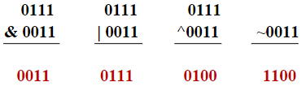

# 第二章 基础知识

- 标识符
- 数据类型
- 变量和赋值
- 常量
- 运算符和表达式
- 字符串
- if语句
- while语句
- do...while语句
- for语句
- switch语句
- break与continue
- 综合实例十进制与二进制转换

## 2.1 标识符

Java程序的**标识符**是赋予**变量**、**类**、**方法**或**接口**的名称。

- 标识符是以**字母**、**下划线**（_）或**美元符**（$）开头
- 由**字母**、**数字**、**下划线**（_）或**美元符**（$）组成的字符串
- **标识符区分大小写**，**没有长度限制**，**不能使用关键字**（p.20）
- 不能含有其他符号，例如：＋、－、*、#等
- 不允许插入空格

例如:

```java
public class HelloWorld { 
    ........................ 
}
```

**public**是关键字，表示**访问权限**，可以被其他类引用。

**class** 是关键字，表示定义一个类。

**HelloWorld**是标识符，给出类的名字。 Java有许多关键字，它们具有特殊意义和用法，不能作为标识符

**关键字:**

又称为保留字，是Java语言中由系统规定的标识符，其含
义和用法由系统事先规定具有专门的意义和用途，不能当作一般的标识符使用。  

abstract break byte boolean catch case class char
continue default double do else extends false final
float for finally if import implements int interface
instanceof long length native new null package private  
protected public final return switch synchronized short  
static super try true this throw throws thread
transient void while
>要记忆！！

判断以下标识符是否正确。

- (1)    _Name
- (2)    $Name
- (3)    _Name$
- (4)    Name$3
- (5)    3Name$
- (6)    Name 3
- (7)    Na_me
- (8)    name#
- (9)    super
- (10)    this

- 类名一般是名词，包括大小写字母，每个单词首字母大写。

例：HelloWorld、People、MergeSort

- 方法名一般是动词，包括大小写字母，第一个单词的首字母小写，其余单词首字母大写。尽量不要在方法名中使用下划线。

例：getName、search、setColor

- 常量一般用大写字母表示，单词与单词之间用下划线分割。

例：PI、MAX_NUMBER

- 变量也使用混合大小写形式，第一个单词首字母小写，后面的单词首字母大写。避免使用下划线、美元符号。

例：blance、orders、byPercent

## 2.2数据类型


### 基本数据类型

由编程语言定义、不可再划分，所占内存空间大小固定，与软硬件环境无关。每种基本数据类型都有默认值对应，使基本数据类型的变量有确定值，便于编译器对数据类型检查，保证Java语言**跨平台性**和**安全性**。

### 复合数据类型

包括数组、类、接口等。**基本数据类型变量**内存中存储**数据值**。**复合数据类型变量**存储的是数据的**首地址**，不是数值本身。因此，复合型变量又称为**引用变量**。

### 2.2.1 基本数据类型

**基本类型：**在Java语言中，**基本数据类型的长度是固定的**，不依赖于具体的计算机硬软件平台环境，这使得Java语言具有良好的**跨平台特性**和**可移植性**。


#### 整数类型

- 整数类型包括字节型**byte**、短整型**short**、整型**int**和长整型**long**四种类型。
- **长整数**的表示方法为在数值后面添加一个字母**L**（或**l**）。
例如：456l，189450L，5L

#### 整型数据——byte, short, int, long

- 整型常量
- 1. 十进制整数  
如123，－456。
- 2. 八进制整数
以**0**开头，如**0123**表示十进制数**83**，**－011**表示
十进制数**－9**。
- 3. 十六进制整数
以**0x**或**0X**开头，如**0x123**表示十进制数291，**－0X12**表示十进制数－18。

- 整型变量
类型为**byte**、**short**、**int**或**long**，byte在机器中占8位，short占16位，int占32位，long占64位。

整型变量的定义如：  
int x=123;       // 指定变量x 为int 型，且赋初值为123
byte b = 8;   short s = 10;   **long y = 123L**;   **long z = 123l**;

#### 浮点型

- Java语言共有两种浮点类型：单精度类型**float**和双精度类型**double**。  
- **浮点型数据只采用十进制数表示**，其表示方式可以为**小数**和**指数**两种形式。为了区分单精度数和双精度数，在**单精度数**后面必须添加字符**f**（或**F**），双精度数后面添加字符**d**（或**D**），**或者不添加任何字符**。小数形式的浮点数表示如下:
35.14**f**，4.678**f**，-0.675**f**，78.09**F**，45.789**d**，**78.09**，-0.675**D**

- 指数形式的浮点数中必须包含指数部分，指数部分由字符e（或E）和一个带符号数组成，具体实例表示如下：
0.45e45f，4.795E7f，7.09e8d，5e43，8.706E4D

#### 字符型

- 字符型数据表示单个Unicode编码中的字符，Unicode是一种新的国际标准编码方案，每个Unicode字符占用**16个比特位**，即两个字节的内存空间，它包含的信息量比一个字节编码的ASCII标准码多了一倍。  
- 字符型常数的表示有两种:
  - **为用单引号括起来的字符**。例如：
  
    'A'        '7'         '{'         '\u0041'
  
  - **转义符**：
  
    '\b'  :  退格

    '\r'  :  回车
  
    '\n'  :  换行

    '\“'  :  双引号

    '\\'  :  反斜杠

- Unicode编码通常采用**16进制编码**方案表示，范围从`\u0000`到`\uffff`。转义符`\u`是Unicode编码的前缀，表示这是一个Unicode编码。

#### 布尔型

- 布尔型数据用于逻辑测试功能，主要用在**选择语句**和**循环语句**中，用于判断条件是否成立，从而决定下步的操作。布尔型数据只有两个值：`true`和`false`，分别表示逻辑真和逻辑假。

>C语言的布尔型常量如何表示？

### 数据类型转换

#### 隐式类型转换

整型、实型、字符型数据可以混合运算。运算中，不同类型的数据先转化为同一类型，然后进行运算，转换从低级到高级：

低----------------------------------------------------->高

byte,short,char—> int —> long—> float —> double

|操作数1类型|操作数类型|转换后的类型|
|---|---|---|
|byte、short、char|int|int|  
|byte、short、char、int|long|long|  
|byte、short、char、int、long|float|float|  
|byte、short、char、int、long、float|double|double|

如果从**高级转换成低级**，则需要**强制类型转换**，但会导致**溢出**或**精度下降**。

#### 其他类型相互转换

#### 字符串类型转换成数值型

`Integer.parseInt(“24”);`

`Double.parseDouble(“24”);`

#### Math.round()方法转换

将`Double`数值四舍五入为`Long`型

#### 类型转换

**强制类型转换会缩小值的范围**(“chops it down”)

- byte num1 = 53;
- byte num2 = 47;
- long num3;
- num3 = (num1+num2);  
- int myInt;
- long myLong = 99L;
- myInt = (int) (myLong);
- int myInt;
- long myLong = 123422222222;
- myInt = (int) (myLong);  

### 常量

数据的值不变就是常量。例如，考试的最高成绩（1 0 0 ），一天内的小时数（2 4 ），π的数值（3.14159...）等，这些例子中的数值保持不变。在程序中数值固定的变量一般声明为常量。在Java中，常量的声明与变量类似，只是在前面要增加关键字`final`。例如：

```java
final  int HOURS = 24;      // 创建一个常量
HOURS = 12;          // 修改常量值，会产生错误。
```

### 运算符

#### 赋值运算符

赋值运算符作用是将右边表达式的值赋给左边的变量。

表现形式为：
`vname = expression`
例如：
`y = 4;`
`y *= 5;`

- 赋值表达式右边的表达式也可以是一个**赋值表达式**，这样的赋值表达式遵循右结合规律。
例如：`x = y = 7`

#### 算术运算符  

- 算数运算符对数值型数据（整型数据和浮点型数据）进行运算。  
- 一元运算符：`+`、 `-`、 `++`和 `--`四种；
- 二元运算符：`＋`、`―`、`*`、`/`，`%`五种。

#### 字符串连接运算符

**Java 中对运算符`+`进行了重载**（就是对同一个运算符赋予了两种以上的含义，在不同的场合可以标记不同的操作。）字符串连接运算符的操作有**两种**情况：

>C 语言如何处理？

- 字符串+字符串
- 字符串+基本数据类型数据或对象

例如 `"hello"+"world"`结果为‚`"hello world"`

`int c=100;`

`"c="+c`的结果为‚`"c=100"`

#### 关系运算符

- 关系运算用来比较两个数据之间的关系，并产生一个布尔型值true或者false。
- 关系表达式经常用在条件判断语句和循环条件判断中.  
  
|运算符|运算|用法|意义|
|---|---|---|---|
|==|等于|op1 == op2|op1与op2相同时，结果为真|
|!=|不等于|op1 !＝ op2|op1与op2不同时，结果为真|
|>|大于|op1 > op2|op1大于op2时，结果为真|
|<|小于|op1 < op2|op1小于op2时，结果为真|
|>=|大于等于|op1 >= op2|op1大于或者等于op2时，结果为真|
|<=|小于等于|op1 <= op2|op1小于或者等于op2时，结果为真|

#### 逻辑运算符

- 逻辑运算是用来在布尔型数据之间进行比较的运算，运算的结果仍为布尔型值。逻辑运算常用来连接关系表达式。
- &与&&，|与||的区别
- `boolean b = (x>y) && (++x<y)`与
- `boolean b = (x>y) & (++x<y)`

|运算符|运算|用法|意义|
|---|---|---|---|
|&|与|op1 & op2|op1 与 op2都为真时，结果为真|
|\||或|op1 \| op2|op1 与 op2都为假时，结果为假|
|!|非|! op|op为假时，结果为真，反之为假|
|^|异或|op1 ^ op2|op1 与 op2相同时，结果为假|
|&&|条件与|op1 && op2|op1 与 op2都为真时，结果为真|
|\|\||条件或|op1 \|\| op2|op1 与 op2都为假时，结果为假|

#### 位运算符

- 位运算是对整数按其二进制位进行运算，运算结果仍是整数。  

运算符|运算|用法|意义
------|----|---|-----
&|按位与|op1 & op2|op1 与 op2的二进制数进行按位与
\||按位或|op1 | op2 op1 与 op2的二进制数进行按位或
^|按位异或|op1 ^ op2|op1 与 op2相同时，结果为假
~|按位取反|~ op|将op按位求反
\>>|算术右移|op >> n|将op各位右移n位
<<|算术左移|op << n|将op各位左移n位
\>>>|无符号右移|op>>>n|将op各位右移n位，空位补0

#### 按位逻辑运算

- 令x=7，y=3，对它们进行逻辑运算，具体为：



- 运算结果为（十进制）？

#### 算术移位运算  

- 算数左移运算符（`＜＜`）和算术右移运算符（`＞＞`）进行移位运算时，按照补码移位规则进行，即左移时，空位补`0`；右移时，空位补符号位，正数补`0`，负数补`1`。
- 无符号右移运算符（`＞＞＞`）表示无论操作数是负数还是正数，移位时空位补`0`。

#### 其它运算符

##### 1.复合赋值运算符

运算符|用法|意义
---|---|---
＋＝|op1 ＋＝ op2|op1 ＝ op1＋op2
－＝|op1 －＝ op2|op1 ＝ op1－op2
\*＝|op1 \*＝ op2|op1 ＝ op1\*op2
／＝|op1 ／＝ op2|op1 ＝ op1/op2
%＝|op1 %＝ op2|op1 ＝ op1%op2
&＝|op1 &＝ op2|op1 ＝ op1&op2
\|＝|op1 \|＝ op2|op1 ＝ op1\|op2
^＝|op1 ^＝ op2|op1 ＝ op1^op2
＜＜＝|op1 ＜＜＝ op2|op1 ＝ op1＜＜op2
＞＞＝|op1 ＞＞＝ op2|op1 = op1＞＞op2
＞＞＞＝|op1 ＞＞＞＝ op2|op1 ＝ op1＞＞＞op2

##### 2.条件运算符

条件运算符是三元运算符，可以代替某些`if-else`语句。

条件运算符的一般形式为：

`exp1? exp2 : exp3`

例：

```java
int x = 5, z = 7;
int y; 
y =  x > z ? x : z; 
```

##### 3.对象运算符

- 对象运算符为`instanceof`，用来测试一个**对象是否属于某个指定类**（或其**子类**）的**实例**，如果是，返回结果true，否则返回结果false。
  
例如: `boolean b = myHero  instanceof  Hero;`

### Java运算符和表达式

```text
运算符的优先次序 
1） . , [] , ()                   9） & 
2） ++ , -- , ! , ~ , instanceof  10） ^  
3） new (type)                    11） | 
4） * , / , %                     12） && 
5） + , -                         13） || 
6） >> , >>> , <<                 14） ?: 
7） > , < , >= , <=               15） = , += , -= , *= , /= , %= , ^= 
8） == , !=                       16） &= , |= , <<= , >>= , >>>=  
```

#### 表达式

表达式是由操作数和运算符按一定的语法形式组成的符号序列。

- 一个常量或一个变量名字是最简单的表达式，其值即该常量或变量的值;
- 表达式的值还可以用作其他运算的操作数，形成更复杂的表达式。

例：

`x  num1+num2    a*(b+c)+d`

`3.14  x<=(y+z)   x&&y||z`

【例2.1】 一元算数运算实例

```java
  //Test.java
public class Test {
    public static void main(String args[]){
        int k, m;
        float f, g;
        k = 15;
        m = ++k;
        System.out.println("m=" + m + " ,  k=" + k);
        f  = 5.4f;
        g = f--;
        System.out.println("f=" + f + " ,  g=" + g);
    }
}  
```

>运行结果为：
>
>m=16 ,  k=16
>
>f=4.4 ,  g=5.4

【例2.2】比较运算符实例

```java
//Operators1.java 
public class Operators1 {   
    public static void main(String args[]){ 
        short aa = 10, cc = 23; 
        boolean  bb = aa > cc;          // 比较aa 是否大于cc 
        System.out.println("aa>cc?" +bb);  
        String st1 = new String("how are you"); 
        String st2 = new String("how are you"); 
        if( st1 == st2)                
        // 比较st1和st2是否为同一对象的引用 
        System.out.println("st1==st2?" + true);     
        else        
        System.out.println("st1==st2?"+ false); 
      } 
}  
```

>运行结果为：`aa>cc ? false  st1==st2 ? false`

【例2.3】布尔运算实例

```java
//Operators2.java
public class Operators2 {   
    public static void main(String args[]){ 
        int val; 
        val = Integer.parseInt(args[0]);
        if(val != 0 && 1.0/val < Double.MAX_VALUE) {  
            System.out.println("val 的倒数为：" + 1.0 / val);
        }else { 
            System.out.println("val 的倒数为无穷大"); 
        } 
    } 
} 
```

>运行结果：java Operators2  4
>
>运行结果为：val的倒数为：0.25  

## 2.6 字符串

到目前为止，所使用的数据类型都还是所提到的Java基本数据类型。

字符串就是字符的一个序列，像姓名、地址等。它的声明像  int  或char变量一样。但要注意，字符串String是以大写`S`开头的。

例如：

`String  name;`

`name = "Martin";`

字符串可以使用`+`运算符把多个字符串拼接；用赋值运算符（=）处理字符串，赋值操作可以采用如
下方式:

【例2.4】字符串输入实例

```java
//StringTest.java
import java.util.*;    
public class StringTest {   
    public static void main(String args[]){    
        Scanner sc = new Scanner(System.in);  // 创建键盘输入对象    
        String name;                          // 声明String类型的姓名变量    
        int age;                              //  声明int类型的年龄变量    
        System.out.print("what is your name?"); 
        name = sc.next();                     // 从键盘输入String类型的姓名 
        System.out.print("What is your age?"); 
        age = sc.nextInt();                   //  从键盘输入int类型的年龄 
        System.out.println("Hello " + name ); // 输出姓名 
        System.out.println("when I  was your age  I was " +  (age + 1) );    
                                              // 输出年龄 
    } 
} 
```

## 2.7 if语句

### 2.7.1  if语句的三种形式

第一种形式

```java
if( 条件语句 ){    
    执行语句块 
}
```

第二种形式

```java
if(条件语句){     
    执行语句块1 
}else{ 
    执行语句块2 
}
```

第三种形式  

```java
if(条件语句1 ){  
    执行语句块1 
}else  if(条件语句2){   
    执行语句块2 
}else if (条件语句3){ 
    执行语句块3 
}
```

【例2.5】

```java
 //TimeTable.java import java.util.*; 
public class TimeTable {   
    public static void main(String args[]){     
        char group;          // 上课时段分组     
        Scanner sc = new Scanner(System.in);     
        System.out.print("Enter your group(A,B,C)");     
        group = sc.next().charAt(0);       
        if(group == 'A') System.out.println("8:00 a.m");       
        else{   
            if(group == 'B') System.out.println("10:00 a.m");           
            else{             
                if(group == 'C') System.out.println("1:00 p.m");              
                else   System.out.println("没有这个时段");                   
            } 
        } 
    }
}
```

## 2.8 switch语句

【例2.6】

```java
 //TimeTable2.java import java.util.*; 
public class TimeTable2 {   
    public static void main(String args[]){     
        char group; // 上课时段分组     
        Scanner sc = new Scanner(System.in);     
        System.out.print("Enter your group(A,B,C)");     
        group = sc.next().charAt(0);  //开始使用switch语句           
        switch  ( group )  {      
            case 'A':  System.out.println("8:00 a.m");  break;      
            case 'B':  System.out.println("10:00 a.m"); break;       
            case 'C':  System.out.println("1:00 p.m");  break;         
            default:    System.out.println("没有这个时段");       
        }            // switch语句结束 
    }
}  
```

## 2.9 for 循环

循环次数已知，一般使用for循环实现，语法如下：

```java
for ( 初始化表达式; 循环条件表达式; 循环后的操作表达式)  {  
    执行语句;       
}
```

【例2.7】 计算10以内整数的和  

```java
//ForSample.java 
class ForSample {   
    public static void main(String args[]){       
        int sum = 0; // 控制循环10次，每次执行sum+i      
        for(int i = 0; i < 10; i++) {           
            sum = sum + i;       
        }       
        System.out.println("sum= " + sum); 
    } 
} 
```

## 2.10 while循环

while循环用于不知道代码需要重复多少次，但有明确的终止条件的情况。语法如下：

```java
while ( 条件表达式 ){      
    执行语句 
} 
```

## 2.11  do..while循环

do..while语句功能和while语句类似，
不过do..while语句是执行完第一次后才检测条件表达式。
这意味着包含在大括号中的程序段至少要被执行一次。
do..while的语法结构如下：

```java
do {         
    执行语句 
} while (条件表达式);
```

## 2.12 break与continue

【例 2.8】打印100以内7的倍数

循环语句只有循环条件表达式为假时才结束循环。
如果希望提前中断循环，使用break语句就终止循环。
也可以使用continue语句，跳过本次循环，然后开始执行下一次循环。

【算法设计】

100以内的循环，循环次数已知，可以使用for循环实现。
当计数器为7的倍数，打印计数器；如果不是，则什么也不做，继续计数。

【源程序】

```java
//Find7Times.java 
class Find7Times {  
    public static void main(String args[]){   
        for (int i = 1; i <= 100; i++){      
            if(i % 7 == 0)   System.out.print(i + "   ");     
            else   continue;   // 结束本次循环，继续执行下一次循环   
        } 
    } 
}
```

>运行结果：7  14  21  28  35  42  49  56  63  70  77  84  91  98

## 2.13 综合实例：十进制与二进制转换

实例:

将十进制数字转为二进制数字，转换方法是基于十进制数字的分解。
例如，19转为二进制为10011，因为19可以表示成19=16+2+1，即19=1*24+1*21+1*20。

【例2.9】进制转换

```java
 //Binary.java 
 import java.util.*; public class Binary {  
    public static void main(String args[]){    
        Scanner sc = new Scanner(System.in);    
        int  n = 0;     // 待转换的十进制数字    
        int  v = 1;     // 当前2的幂方     
        n = sc.nextInt();    
        while( v <= n / 2)   v = 2 * v;    
        int x = n;     // 当前余数    
        while(v>0){       
            if(n<v)  System.out.print(0);        
            else {      
                System.out.print(1);         
                n-=v;         
            }              
            v=v/2;      
        }    
    } 
}
```

## 习题

1.判断下列语句的对错

- （1）一个标识符可以是任何数字和字母的序列。
- （2）在Java中，保留字和预定义的标识符之间没有
- （3）取模运算符的操作数必须是整数。
- （4）如果a的值为4，b的值为3，则在执行了a=b；b的值仍为3。
- （5）在输出语句中，换行符可能是字符串的一部分。

2.以下哪个是Java应用程序main方法的有效定义。

- A．public static void main(String args[])
- B．public static void main()
- C．public static void main(String args)
- D．public static main(String a[])

3.写出表达式的运算结果，设 a=3, b=4

`b !=3 && a * 2 > a + b`

4.给出以下内容的输出结果。

- a. System.out.println(‘b’);
- b. System.out.println(‘a’+‘b’);
- c. System.out.println((char) (‘b’+3));

5.假设x、y、z均为int型变量，且x=2, y=5 , z=9。在执行了下面每个语句后将输出什么？

- （1）System.out.println(‚ x = ‛ + x + ‚ ,y = ‛ + y + ‚ ,z = ‛ + z);
- （2）System.out.println(‚x + y = ‛ + ( x + y ));
- （3）System.out.println(‚ sum of ‛ + x +  ‚and ‛ + z + ‛ is ‛ + ( x + z ));
- （4）System.out.println(‚z / x = ‛ + (z / x));
- （5）System.out.println(‚2 times‛ + x + ‛ = ‛ + ( 2 * x ));

6.判断以下语句是否有误，如果有错，请指出。

- （1）if (a > b ) then c=0;
- （2）if a > b { c=0;}
- （3）if (a = b) c=0;
- （4）if (a  > b) c=0 else b=0;

7.给出下列语句执行后j  的值是多少。假设i和j都是整数。

- （1）for (i=0, j =0 ; i<10 ; i++)  j +=i;
- （2）for (i=0, j =1 ; i<10 ; i++)  j +=j;
- （3）for (j =0; j<10 ; j++)  j +=j;
- （4）for (i=0, j =0;  i<10; i++)  j +=j++;

## 编程练习

1.编写程序，提示用户输入一个小数，然后输出与该数最接近的整数。  

2.编写程序，提示用户输入一个4位正整数。
该程序将以每行一个数字输出该数。
例如，如果输入为6438，则输出为：

```text
6 
4 
3     
8 
```

3.编写程序，分别获得一个数的整数和小数部分，并输出。
例如，5.01，在屏幕上分别输出整数5和小数0.01。  

4.设计并实现一个要求用户输入两个数并猜测两数之和的程序。
如果用户猜对结果，就显示祝贺消息，否则显示慰问信息以及正确答案。  

5.甲乙两人打赌，看谁赚的钱多。甲承诺每天给乙1000元钱。
乙承诺第一天给甲1分钱，第二天给甲2分钱，第三天给甲4分钱，第四天给甲8分钱......。
请问30天后，甲乙谁赢？编写程序，判断甲乙谁赢？**（作业）**

6.设计一个自动售货机，提供如下选择 **（作业）**

- [1] 口香糖
- [2] 巧克力
- [3] 爆米花
- [4] 果汁
- [5] 显示购买总数  
- [6] 退出

允许用户连续的从这些选项中进行选择。
当选中1－4选项时，显示适当的信息确认选项。
例如当用户选择3时，可以显示如下信息:

您购买了爆米花当用户选择5时，显示已经售出的每种商品的数量。
例如：

- 您购买了2个口香糖
- 您购买了3个巧克力
- 您购买了3杯果汁

当用户选择6时，程序终止。
如果输入1－6以外的选项，显示出错信息，例如： 错误，请输入1-6内的数字!

7.编写程序，提示用户输入笛卡尔平面中某一点x-y坐标。
程序应输出一条消息指出此点是原点，位于x或y轴上，还是在特定象限上。

例如：

- (0,0) is origin
- (4,0) is on the x-axis
- (0,-8) is on the y-axis
- (-2,5) is in the second quadrant

## 习题2

1.判断下列语句的对错

- （1）一个标识符可以是任何数字和字母的序列。
- （2）在Java中，保留字和预定义的标识符之间没有区别。
- （3）取模运算符的操作数必须是整数。
- （4）如果a的值为4,b的值为3,则在执行了a=b；b的值仍为3。
- （5）在输出语句中，换行符可能是字符串的一部分。

答：（1）F（2）F（3）T（4）T（5）T

2.以下哪个是Java应用程序main方法的有效定义(A)。

- A．public static void main(String args[]);
- B．public static void main();
- C．public static void main(String args);
- D．public static main(String a[])

3.写出表达式的运算结果，设 a=3, b=4

```java
b !=3 && a*2 > a+b  
false 
```

4.将小写字母a转变成大写字母A的方法是（B ）

- A．Character.touppercase(‘A’)
- B．Character.toUpperCase(‘a’)
- C．Character.toLowerCase(‘A’)
- D．Character.tolowercase(‘A’)

5.给出以下内容的输出结果。

- a. System.out.println(‘b’);
- b. System.out.println(‘a’+‘b’);
- c. System.out.println((char) (‘b’+3));

- a.答：b
- b.答：195
- c.答：e

6.将下面的句子编写成Java的表达式。

- （1）-10乘以a
- （2）（b2-4ac）/2a
- （3）代表9的字符
- （4）（-b + (b2-4ac)）/2a

答：

- （1）~(10*a)+1
- （2）（b*b-4*a*c)/2/a
- （3）String.valueOf(9)
- （4）（-b+ (b*b-4*a*c)）/2/a)

7.假设x是一个int型变量，y是一个double型变量。写出执行结果。

```java
x = Integer.parseInt("856");
y = Double.parseDouble("14.9");
```

答：

```java
x =856
y = 14.9
```

8.假设x、y、z均为int型变量，且x=2,y=5,z=9。在执行了下面每个语句后将输出什么？

- （1）System.out.println("x="  +x+  ",y="  +  y  + ",z="+z);
- （2）System.out.println("x+y="+(x+y));
- （3）System.out.println("sum  of"+x+  "and  "+z+"is "+(x+z));
- （4）System.out.println("z/x="+(z/x));
- （5）System.out.println("2 times"+x+"="+(2*x));

答：

- (1) x=2,y=5,z=9
- (2) x+y=7
- (3) sum of2and 9is 11
- (4) z/x=4
- (5) 2 times2=4
