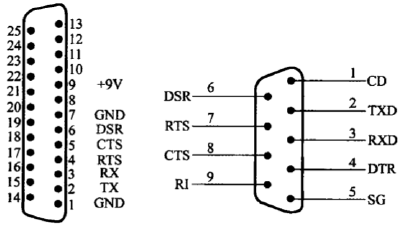

# 第5章 **文件**和**时间**编程 (调用接口)

5.1 文件编程
5.2 时间编程

## 5.1 文件编程

- Linux中文件编程有两种方法：
  - **Linux系统调用**
  - **C语言库函数**
- 前者依赖与linux系统，后者与操作系统是独立的，在任何操作系统下，使用C语言库函数操作文件的方法是相同的。

### *5.1.1 Linux系统调用(Embedded OS)

- 所谓**系统调用(System Call)**是指操作系统提供给用户程序调用的一组**“特殊”接口(Application Programming Interface, API)**，用户程序可以通过这组“特殊”接口来获得操作系统内核提供的服务(System services)。例如用户可以通过进程控制相关的系统调用来创建进程、实现进程调度、进程管理等。
- 为什么用户程序不能直接访问系统内核提供的服务呢？这是由于在Linux中，为了更好地保护内核空间，将程序的运行空间分为内核空间和用户空间（也就是常称的内核态和用户态），它们分别运行在不同的级别上，在逻辑上是相互隔离的。因此，用户进程在通常情况下不允许访问内核数据，也无法使用内核函数，它们只能在用户空间操作用户数据，**调用用户空间的函数**。
- 但是，在有些情况下，用户空间的进程需要获得一定的系统服务（调用内核空 间程序），这时操作系统就必须利用系统提供给用户的“特殊接口”——系统调用 规定用户进程进入内核空间的具体位置。进行系统调用时，程序运行空间需要 从用户空间进入内核空间，处理完后再返回到用户空间。

### 5.1.2 API

- 前面讲到的系统调用并不是直接与程序员进行交互的， 它仅仅是一个通过软中断机制向内核提交请求，以获取 内核服务的接口。在实际使用中程序员调用的通常是用 户编程接口——API
- 系统命令相对API更高了一层，它实际上一个可执行程序， 它的内部引用了用户编程接口（API）来实现相应的功能。


### 5.1.3 Linux中文件及文件描述符

- 内核如何区分和引用特定的文件呢？这里用到了一个重要的概念——文件描述符。对于Linux而言，**所有对设备和文件的操作都是使用文件描述符来进行的**。文件描述 符是一个非负的整数，它是一个索引值，并指向在内核 中每个进程打开文件的记录表。当打开一个现存文件或 创建一个新文件时，内核就向进程返回一个文件描述符； 当需要读写文件时，也需要把**文件描述符作为参数传递给相应的函数**。
- 通常，一个**进程启动**时，都会打开3个文件：**标准输入、 标准输出和标准出错处理**。这3个文件分别对应文件描述 符为0、1和2（也就是宏替换STDIN_FILENO、 STDOUT_FILENO和STDERR_FILENO）。

### 5.1.4 Linux中文件相关的系统调用

- 创建文件
- 打开文件
- 关闭文件
- 读写文件
- 文件定位
- 访问判断

#### （1）系统调用-创建

- int create(const char* filename, mode_t mode)
  - filename：要创建的文件名，包含路径，缺省为当前路径
  - mode：创建模式
    - S_IRUSR 可读
    - S_IWUSR 可写
    - S_IXUSR 可执行
    - S_IRWXU 可读、可写、可执行
- 除了可以使用上诉宏以外，可以直接使用数字来表示文件的访问
    权限：
  - 可执行-> 1
  - 可写 -> 2
  - 可读 -> 4
  - 上述权限值的和，可读可写-> 6
  - 无任何权限-> 0
- 返回值：成功返回文件描述符，否则返回-1
- 实例：file_creat.c

#### （2）系统调用-打开

- int open(const char* pathname,int flags)
- int open(const char* pathname,int flags,mode_t mode)
  - pathname: 要打开的文件名称，包含路径
  - flags：打开标志
    - O_RDONLY 只读方式打开
    - O_WRONLY 只写方式打开
    - O_RDWR 读写方式打开
    - O_APPEND 追加方式打开
    - O_CREAT 创建一个文件
    - O_NOBLOCK   非阻塞方式打开
- 如果使用了O_CREATE标志，则使用的函数是:
    `int open(const char* pathname,int flags,mode_t mode)`
- 这时需要指定mode来表示文件的访问权限
- 返回值：打开成功返回文件描述符
- 实例:file_open.c

#### （3）系统调用-关闭

- 当操作完文件以后，需要关闭文件：
    `int close(int fd)`
  - fd:文件描述符
  - 返回0：成功，-1：失败

#### （4）系统调用-读和写

- `int read(int fd, const void* buf, size_t length)`
  - 功能：从文件描述符fd所指定的文件中读取length个字节到buf所指向的缓冲区中。
  - 返回值为实际读取的字节数。
- `int write(int fd, const void* buf, size_t length)`
  - 功能：把length个字节从buf指向的缓冲区中写到文件描述符fd所指向的文件中。
  - 返回值为实际写入的字节数。
- 举例:file_cp.c

#### （5）系统调用-定位

- int lseek(int fd,offset_t offset,int whence)
- 功能：将文件读写指针相对whence移动offset个字节。操作成功时，返回文件指针相对于文件头的位置。
  - Whence可使用下述值：
    - SEEK_SET：相对文件头
    - SEEK_CUR: 相对文件读写指针的当前位置
    - SEEK_END: 相对文件尾
- Offset可取负值，表示向前移动。例如下述调用可将文件指针相对当前位置向前移动5个字节
    lseek(fd,-5,SEEK_CUR)
- 如何利用lseek来计算文件长度？
- 由于lseek函数的返回值为文件指针相对于文件头的位置，因此下面调用的返回值就是文件的长度：lseek(fd,0,SEEK_END)

#### （6）系统调用-访问判断

- 有时我们需要判断文件是否可以进行某种操作（读、写等），这时可以使用access函数：
    `int access(const char* pathname,int mode)`
  - pathname:文件名称
  - mode：要判断文件的访问权限，可以取一下值或者它们的组合。R_OK:
    文件可读，W_OK：文件可写，X_OK：文件可执行，F_OK：文件存在。
  - 返回值：当我们测试成功时，函数返回0，否则如果一个条件不符合时，返回-1。
- 例：

    ```c
    #include <unistd.h>
    {
    if(access(“/etc/passwd”,R_OK)==0)
    printf(“/etc/passwd can be read!\n”);
    }
    ```

## 5.2 串口编程

- 用户常见的数据通信方式有两种
  - 并行通信
  - 串行通信
- 串行口是计算机常用的接口，具有连接线少，通信简单的特点，得到广泛的使用。
- 常用的串口是RS232C接口，该标准规定采用一个DB25芯引脚或DB9芯引脚的连接器。
    
- 在linux中，所有的设备文件一般都位于/dev下。
- 串口1和串口2对应的设备名依次为/dev/ttyS0和/dev/ttyS1
- USB转串口的设备名通常为/dev/ttyUSB0
- Linux下操作串口和操作文件相同。
- 串口操作流程：
    

### 5.2.1 打开串口

- 打开串口是通过标准的文件打开函数操作

    ```c
    int fd;
    fd = open(“/dev/ttyS0”,O_RDWR|O_NOCTTY| O_NONBLOCK);
    if(-1 == fd)
    {
        perror(“open error”);
    }
    ```

- O_NOCTTY:如果路径名指向终端设备，不要把这个设备用作控制终端
- O_NONBLOCK:如果路径名指向FIFO/块文件/字符文件，则把文件的打开和后继I/O设置为非阻塞模式（nonblocking mode）
- 对于串口的打开操作，必须使用O_NOCTTY参数，它表示打开的是一个 终端设备，程序不会成为该端口的控制终端。如果不使用此标志，任务 的一个输入都会影响进程。如键盘上过来的Ctrl+C中止信号等都将影响进程。

### 5.2.2 串口设置

- 串口的参数配置主要包括：波特率、数据位、停止位、校验位、流控协议。
- 串口的设置主要是设置struct termios结构体的各成员值，如下所示：

    ````c
    #include<termios.h>
    struct termios
    {
        unsigned short c_iflag; // 输入模式标志
        unsigned short c_oflag; // 输出模式标志
        unsigned short c_cflag; // 控制模式标志
        unsigned short c_lflag; // 本地模式标志
        unsigned char c_line; // 行控制
        unsigned char c_cc[NCC]; // 控制字符
    };
    ```

    每个标志位的含义具体见教材

- 串口设置时常用的函数：
  - tcgetattr函数
  - cfgetispeed函数
  - cfgetospeed函数
  - cfsetispeed函数
  - cfsetospeed函数
  - tcflush函数
  - tcsetattr函数
- 读取当前参数函数：
  - `int tcgetattr(int fd,struct termios *termios_p)`
  - `fd`：`open`操作后返回的文件句柄
  - `*termios_p`：为前面介绍的结构体
  - 初始化开始前调用这个函数.
- 获取当前波特率函数：
  - `int speed_t cfgetispeed(const struct termios *termios_p)`
  - `int speed_t cfgetospeed(const struct termios *termios_p)`
  - `*termios_p`：为前面介绍的结构体
  - 成功返回`0`，失败返回`-1`
- 波特率设置函数：
  - `int cfsetispeed(struct termios *termios_p,speed_t speed)`
  - `int cfsetospeed(struct termios *termios_p,speed_t speed)`
  - `*termios_p`：为前面介绍的结构体
  - `speed`：波特率，常用`B2400`，`B4800`，`B9600`，`B115200`，`B460800`
  - 成功返回`0`，失败返回`-1`
- 清空`buffer`数据函数：
  - `int tcflush(int fd,int queue_selector)`
  - `queue_selector`:有三个常用宏定义
    - `TCIFLUSH`:清空正读的数据，且不会读出
    - `TCOFLUSH`:清空正写入的数据，且不会发送到终端
    - `TCIOFLUSH`:清空所有正在发生的I/O数据.
  - 成功返回`0`，失败返回`-1`
- 设置串口参数函数：
  - `int tcsetattr(int fd,int optional_actions,cons struct termios *termios_p)`
  - `optional_actions`:有三个常用宏定义
    - `TCSANOW`:不等数据传输完毕，立即改变属性
    - `TCSADRAIN`:等所有数据传输完毕，再改变属性
    - `TCSAFLUSH`:清空输入输出缓冲区才改变属性
  - 成功返回`0`，失败返回`-1`
- 设置流程
  - 保存原串口配置，使用tcgetattr
  - 激活选项CLOCAL和CREAD，用于本地连接和接收使能
      newtio.c_cflag|=CLOCAL|CREAD
  - 设置波特率，使用cfsetispeed、cfsetospeed
  - 设置数据位、奇偶校验位、停止位
  - 设置最少字符和等待时间，对于接收字符和等待时间没有特别要求时，
      可以设置为0
  - 刷新缓冲区，使用tcflush
  - 激活配置，使用tcsetattr

### 5.2.3 串口读写

- 串口读写使用文件读写`read`、`write`。
- 读写完毕进行关闭`close(fd)`
- 实例分析`serial.c`

## 5.3 时间编程

- 时间类型
  - Coordinated Universal Time (UTC)：世界标准时间，也就是大家熟知的格林威治标准时间，（Greenwich Mean Time，GMT）。
  - Calendar Time：日历时间，是用“从一个标准时间点（如：1970年1月1日0点）到此时经过的秒数”来表示的时间。

### 5.3.1 时间获取

- `#include <time.h>`
  - `time_t time(time_t *tloc)`
  - 功能：获取日历时间，即从1970年1月1日0点到现在所经历的秒数。
- 参数*tloc是指针
- time_t 类型在time.h中定义
  - 例如：time_t t;
        t=time((time_t*)NULL);返回值为长整形数
  - 或者：time_t *t; time(t);

### 5.3.2 时间转换

- `struct tm *gmtime(const time_t *timep)`
    功能：将日历时间转化为格林威治标准时间，并保存到TM结构。
- `struct tm *localtime(const time_t *timep)`
    功能：将日历时间转化为本地时间，并保存至TM结构。

```c
struct tm{
    int tm_sec; //秒值
    int tm_min; //分钟值
    int tm_hour; //小时值
    int tm_mday; //本月第几日
    int tm_mon; //本年第几月
    int tm_year; //tm_year+1900=哪一年
    int tm_wday; //本周第几日
    int tm_yday; //本年第几日
    int tm_isdst; //是否使用夏令时，1使用，0未使用
}
```

程序举例：

```c
//time1.c
#include <time.h>
#include <stdio.h>
int main()
{
    struct tm *local;
    time_t t;
    t=time(null);
    local=localtime(&t);
    printf(“Local hour is: %d\n”,local->tm_hour);
    local=gmtime(&t);
    printf(“UTC hour is: %d\n”,local->tm_hour);
}
```

### 5.2.3 时间显示

- `char* asctime(const struct tm *tm)`
  - 功能：将tm格式的时间转化为字符串
  - 如:Sat Jul 30 08:43:03 2005
- `char *ctime(const time_t *timep)`
  - 功能：将日历时间转化为本地时间的字符串形式

程序举例：

```c
//time2.c
#include <time.h>
#include <stdio.h>
int main()
{
    struct tm *ptr;
    time_t lt;
    lt=time(NULL);
    ptr=gmtime(&lt);
    printf(asctime(ptr));
    printf(ctime(&lt));
    return 0;
}
```

### 5.3.4 获取时间差

`int gettimeofday(struct timeval *tv,struct timezone *tz)`

功能：获取从今日凌晨到现在的时间差，常用于计算事件耗时。

```c
struct timeval{
    int tv_sec;//秒数
    int tv_usec;//微秒数
}
```

实例：time3.c

### 5.3.5 延时执行

- `unsigned int sleep(unsigned int seconds)`
  - 功能：使程序睡眠`seconds`秒
- `Void usleep(unsigned long usec)`
  - 功能：使程序睡眠`usec`微妙
