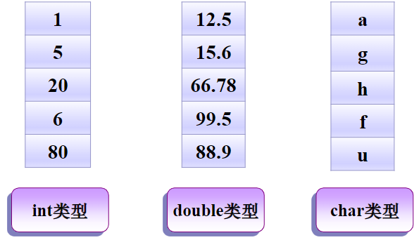
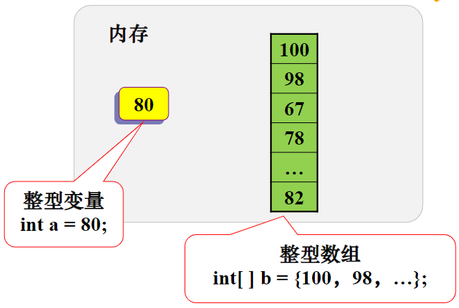
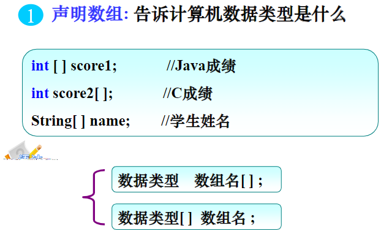
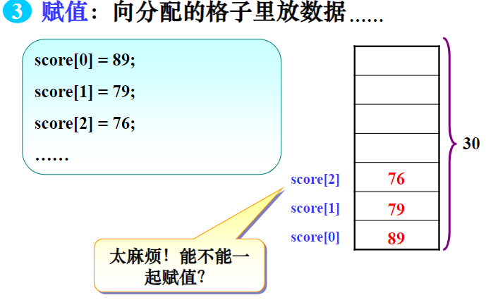
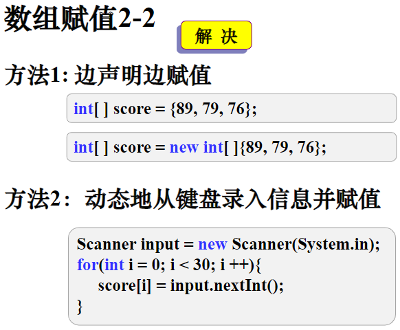
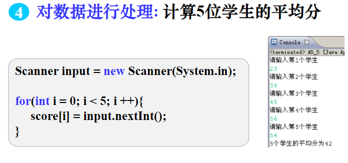

# 第4章 数组

## Java中**print**、**printf**、**println**的区别

- printf主要是继承了C语言的printf的一些特性，可以进行**格式化输出**
- print就是一般的标准输出，但是**不换行**
- println和print基本没什么差别，就是最后**会换行**

- System.out.printf("the number is: d",t);
    参照JAVA API的定义如下：
  - `d` 整数结果被格式化为十进制整数
  - `o` 整数结果被格式化为八进制整数
  - `x`, `X` 整数结果被格式化为十六进制整数
  - `e`, `E` 浮点结果被格式化为用计算机科学记数法表示的十进制数
  - `f` 浮点结果被格式化为十进制数
  - `g`, `G` 浮点根据精度和舍入运算后的值，使用计算机科学记数形式或十进制格式对结果进行格式化。
  - `a`, `A` 浮点结果被格式化为带有效位数和指数的十六进制浮点数Java中print、printf、println的区别

常用方法|方法作用
-------|-----
next()|查找并返回来自此扫描器的下一个完整标记
nextBoolean()| 将输入信息的下一个标记扫描为布尔值
nextByte()| 将输入信息的下一个标记扫描为Byte
nextDouble()| 将输入信息的下一个标记扫描为Double
nextInt()| 将输入信息的下一个标记扫描为Int
nextLine()| 次扫描器执行当前行，并返回跳过的输入信息
nextLong()| 将输入信息的下一个标记扫描为Long
nextShort()| 将输入信息的下一个标记扫描为Short

## next() 与nextLine() 区别

next():

- 一定要读取到有效字符后才可以结束输入。
- 对输入有效字符之前遇到的空白，next() 方法会自动将其去掉。
- 只有输入有效字符后才将其后面输入的空白作为分隔符或者结束符。
- next() 不能得到带有空格的字符串。

nextLine()：

- 以Enter为结束符,也就是说nextLine()方法返回的是输入回车之前的所有字符。
- 可以获得空白

## 目录

- 创建数组
- 初始化一维数组
- 数组名的使用
- 数组作为方法

## 为什么需要数组

### 3-1


### 3-2


### 3-3

- 类比博物架：可不可以把数据归类存放？
- 分类存放不同类型的数据



## 4.1 创建数组

- 数组声明与基本数据类型类似，要指明数据类型和变量名，但声明时要增加方括号`[]`表示数组。
- 创建数组有两个步骤：
- 声明数组变量。
- 为数组元素分配存储空间。

- 例如，声明一个整数数组：
  - `int [ ] intArray;`
  - `int intArray[];`

- 数组类型和数组名后，只能有一个方括号`[ ]`。声明数组，不会为数组元素分配存储空间，所以声明时没有数组元素的个数。

数组在初始化时才会为数组元素分配空间。
数组元素的存储空间是根据数据类型和数组元素的个数计算。
因此，数组初始化时要提供数组元素的个数。
例如，**定义一个包括10个整数的数组**，并初 始化数组元素：

`intArray = new int [ 10 ];`

new运算符为已经定义了元素类型和个数的数组开辟空间。
数组大小定义后就不能更改。
new分配空间的同时，将初始化数组元素。

### 数组在内存中的存储



### 数组定义

数组是一个变量，连续存储相同**数据类型**的一种结构


### 如何使用数组


### 数组的声明



### Java内存管理

#### 栈内存

- 方法中定义的**基本类型变量**和**对象的引用变量**都在方法的栈内存中分配。
- 在一段代码块（花括号`{ }`之间）定义的变量，Java就在栈中为这个变量分配内存空间。
- **超过变量的作用域**后，Java会自动释放掉分配内存空间。

#### 堆内存

- 由**new**运算符创建的**对象或数组**。
- 由Java虚拟机的自动垃圾回收器管理。
- 堆中产生了数组或对象后，还可以在栈中定义一个特殊的变量。如果该变量的**取值**等于数组或对象在堆内存中的**首地址**，栈中的这个变量就成了**数组**或**对象的引用变量**。
- 引用变量是普通的变量，定义时在栈中分配。
- 数组和对象本身在堆中分配，所占据的内存不会被释放。

## 4.2 初始化一维数组

- 初始化数组就是对已经定义好的数组元素赋初值。

```java
int numbers [ ] = new int [ 10] ; //创建数组
for (int i = 0; i < 9; i++)
numbers[i] = i + 1; //为每个数组元素赋值为i+1
```

### 数组赋值2-1



### 数组赋值2-2



### 使用数组求平均分2-1


### 使用数组求平均分2-2



### 常见错误3-1

```java
public class zxw{
    public static void  main(String[ ] args){
        int[ ] score=new int[ ];//编译出错，没有写明数组的大小
        score[0]=89;
        score[1]=63;
        System.out.print(score[0]);
    }
}
```

### 常见错误3-2

```java
public class zxw{
    public static void  main(String[ ] args){
        int[ ] score=new int[2 ];
        score[0]=89;
        score[1]=63;
        score[2]=63;//编译出错，数组越界
        System.out.print(score[0]);
    }
}
```

### 常见错误3-3

```java
public class zxw{
    public static void  main(String[ ] args){
        int[ ] score=new int[5 ];
        //编译出错，创建数组并赋值的方式必须在一条语句中完成
        score={60,90,80,65,39}；//
        int[ ] score2;
        score2={60,90,80,65,39}；//
    }
}
```

### 4.2.1   静态初始化

 静态初始化：直接将数组元素值被花括号括起来并
通过逗号分开。
Int intArray [ ]={1,2,3,4} ;
String stringArray[ ] ={“abc”, “cde”, “fgh”} ;
编译器通过初始化数组元素值的数量确定数组的大小
。静态初始化适用于数组元素的个数较少，且初始元
素可以枚举的情况

### 4.2.2  动态初始化

 根据数组类型又可分为简单类型和引用类
型，它们的初始化步骤有所不同。
简单类型：用new运算符分配内存空间，同时
给数组元素赋值为默认值，不同的数据类型
，默认值不同。
int intArray [ ] ;
intArray= new int [5] ;
