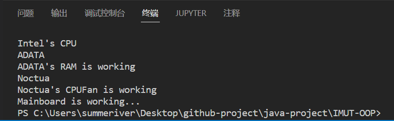

# 第六周作业

## 代码

```java
package lesson8;

interface RAM{
    void Display();
    String getName();
}

interface CPUFan{
    void Display();
    String getName();
}

public class Mainboard {
    String strCPU;
    CPUFan cpuFan;
    RAM ram;

    void setCPU(String strCPU){
        this.strCPU = strCPU;
    }

    //插入CPU风扇
    void setCPUFan(CPUFan cpuFan){
        this.cpuFan = cpuFan;
    }

    //插入内存
    void setRAM(RAM ram){
        this.ram = ram;
    }

    //主板运行，模仿开机显示必要信息
    void run(){
        System.out.println(strCPU);
        System.out.println(ram.getName());
        ram.Display();
        System.out.println(cpuFan.getName());
        cpuFan.Display();
        System.out.println("Mainboard is working...");
    }
}
class ADATA implements RAM{
    String name;

    public ADATA(){
        name = "ADATA";
    }

    public void setName(String name){
        this.name = name;
    }

    @Override
    public void Display() {
        System.out.println("ADATA's RAM is working");
    }

    @Override
    public String getName() {
        return name;
    }
}

class Noctua implements CPUFan{
    String name;

    public Noctua(){
        name = "Noctua";
    }

    public void setName(String name) {
        this.name = name;
    }

    @Override
    public void Display() {
        System.out.println("Noctua's CPUFan is working");
    }

    @Override
    public String getName() {
        return name;
    }
}

class Computer{
    public static void main(String[] args) {
        RAM r = new ADATA();
        CPUFan f = new Noctua();
        Mainboard m = new Mainboard();
        m.setCPU("Intel's CPU");
        m.setRAM(r);
        m.setCPUFan(f);
        m.run();
    }
}
```

## 运行结果


