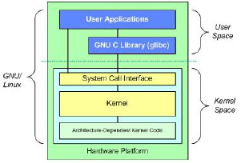
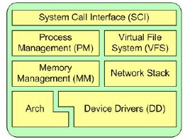
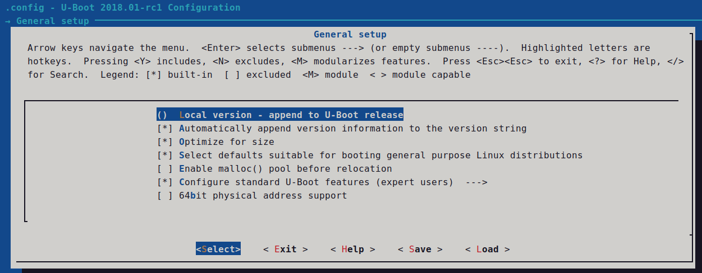
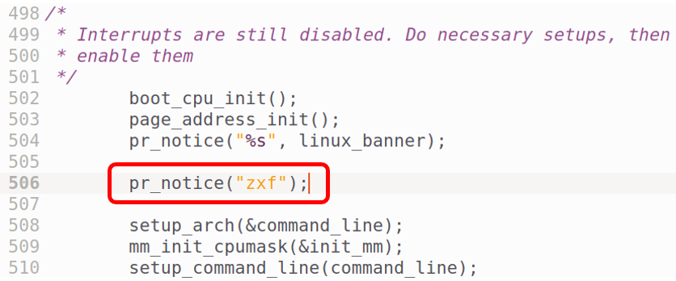
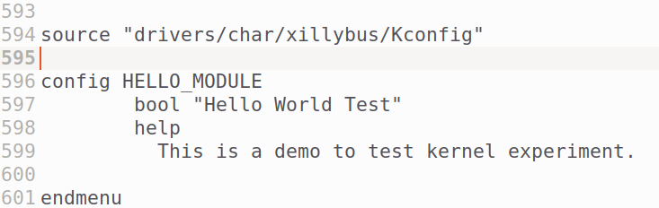
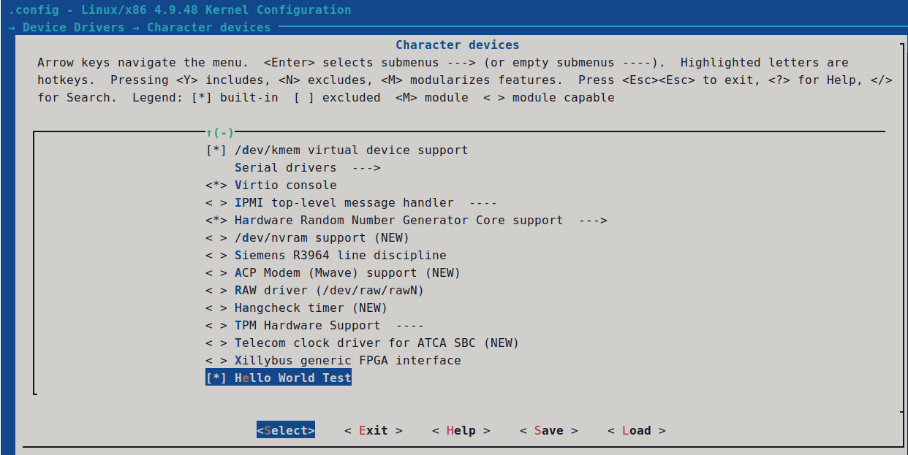
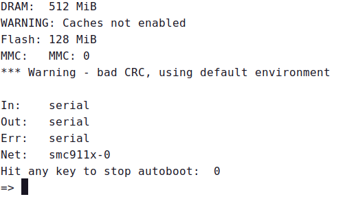
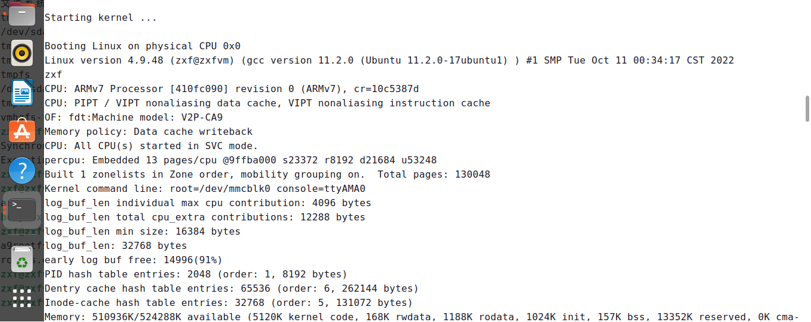
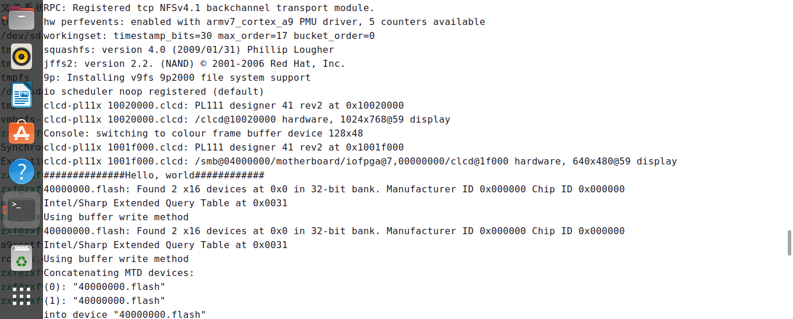
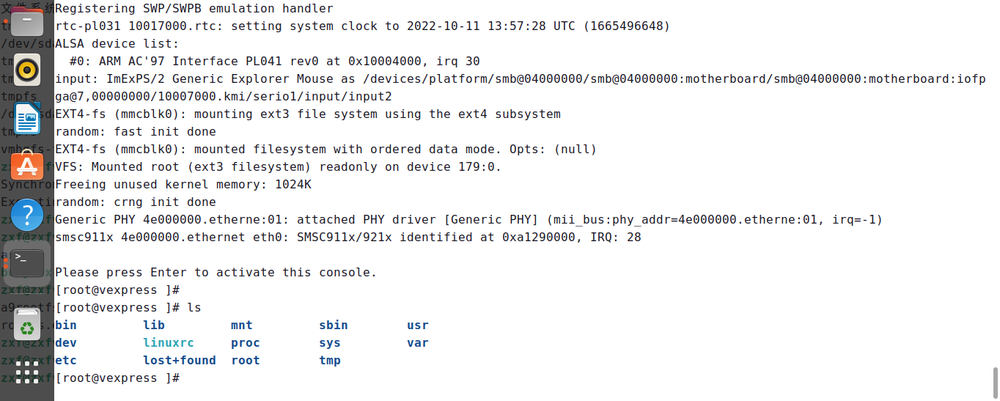

# 实验一 Linux内核移植与编译实验

## 1. 实验目的

- 了解 Linux 内核相关知识与内核结构
- 了解 Linux 内核在 ARM 设备上移植的基本步骤和方法
- 掌握 Linux 内核裁剪与定制的基本方法

## 2. 实验内容

- 分析 Linux 内核的基本结构，了解 Linux 内核在 ARM 设备上移植的一些基本步骤及常识。
- 学习 Linux 内核裁剪定制的基本配置方法，利用QEMU模拟*vexpress_ca9x4*开发板，对Linux 内核进行自定义功能(如helloworld 显示)的添加，并重新编译内核源码，生成内核文件，下载到*vexpress_ca9x4*开发板中测试。

## 3. 实验环境

- 硬件：PC机
- 软件：Vmware Workstation + UBUNTU 22.04 LTS + ARM-LINUX交叉编译开发环境 + QEMU

## 4. 实验原理

### 4.1  Linux 内核背景知识

内核是操作系统的核心，具有很多最基本功能，如虚拟内存、多任务、共享库、需求加载、共享的写时拷贝(copy-on-write)可执行程序和TCP/IP 网络功能。如下图所示：




系统结构框图

上图中最上面是用户（或应用程序）空间。这是用户应用程序执行的地方。用户空间之下是内核空间，Linux 内核正是位于这里。

### 4.2  Linux 内核配置及裁剪

Linux 内核的编译菜单有好几个版本，运行：

- `make config`：命令行配置，界面方式不友好。
- `make menuconfig`：基于光标库运行，界面友好。
- `make xconfig`：基于QT运行库。

`make menuconfig`在选择相应的配置时，有三种选择方式，它们分别代表的含义如下：

- Y－-将该功能编译进内核
- N－-不将该功能编译进内核
- M－-将该功能编译成可以在需要时动态插入到内核中的模块

需要使用空格键进行选取。在每一个选项前都有一个括号， 有的是中括号有的是尖括号，还有圆括号。用空格键选择时可以发现，中括号里要么是空，要么是"*"，而尖括号里可以是空，"*"和"M"这表示前者对应的项要么不要，要么编译到内核里；后者则多一样选择，可以编译成模块。而圆括号的内容是要你在所提供的几个选项中选择一项。

## 5. 实验步骤

### 5.1 基本软件安装和环境配置

#### （1）基本软件安装

```bash
sudo apt-get install qemu
sudo apt-get install qemu-system-arm
sudo apt-get install gcc-arm-linux-gnueabi
sudo apt install gcc
sudo apt install make
sudo apt-get install build-essential
sudo apt-get install libncurses5
sudo apt-get install libncurses5-dev
sudo apt-get install u-boot-tools
```

#### （2）配置tftp

下载tftp：`sudo apt-get install tftp-hpa tftpd-hpa`

修改tftp配置文件（主要是修改tftp的发布目录，自己定义）：`sudo vi /etc/default/tftpd-hpa`

修改内容如下：

```bash
#/etc/default/tftpd-hpa
TFTP_USERNAME="tftp"
# 修改成自己建立的tftp发布目录；当前登录普通用户的主目录位于：`/home/账户名称`
TFTP_DIRECTORY="/home/zz/tftpboot"
TFTP_ADDRESS=":69"
TFTP_OPTIONS="--secure"
```

创建tftp的发布目录：`sudo mkdir ~/tftpboot`

修改tftp的发布目录权限：`sudo chmod 777 ~/tftpboot`

重启tftp服务器来让其生效：`sudo /etc/init.d/tftpd-hpa restart`

#### （3）配置nfs

- 安装nfs服务：`sudo apt-get install nfs-kernel-server`
- 创建nfs目录：`mkdir ~/nfs`
- 配置nfs：`vi /etc/exports`
- 在文件的最后一行添加如下内容：(/home/zz是zz用户的主目录，根据自己建立的nfs目录修改)
  - `/home/zz/nfs  *(rw,nohide,insecure,no_subtree_check,async,no_root_squash)`
- 重启nfs服务：`sudo /etc/init.d/nfs-kernel-server restart`

#### （4）配置qemu和ubuntu网络桥接【可选：这一步骤先略过】

安装工具：

```bash
sudo apt-get install uml-utilities
sudo apt-get install bridge-utils
sudo apt-get install ifupdown
```

打开相应的文件进行配置网络，为qemu添加一块网卡br0：`sudo vi /etc/network/interfaces`

添加（需要注意ens33为当前网卡，如果你的默认网卡是eth0，就要将ens33修改成eth0）：

```bash
auto br0
iface br0 inet dhcp

# iface br0 inet static

# address 192.168.0.1

# netmask 255.255.255.0

# gateway 192.168.0.254

bridge_ports ens33
bridge_fd 9
bridge_hello 2
bridge_maxage 12
bridge_stp off

# The tap0 network interface(s)

auto tap0
iface tap0 inet manual

# iface tap0 inet static

# address 192.168.0.2

# netmask 255.255.255.0

# gateway 192.168.0.254

pre-up tunctl -t tap0 -u root
pre-up ifconfig tap0 0.0.0.0 promisc up
post-up brctl addif br0 tap0
```

重启ubuntu：`sudo init 6`

#### （5）关闭和禁用防火墙

```bash
sudo ufw disable
sudo iptables -F
```

### 5.2 u-boot建立

下载u-boot源代码文件进行解压（可在用户主目录中操作）：`tar -xjvf u-boot-2018.01-rc1.tar.bz2`

进入u-boot文件夹：`cd u-boot-2018.01-rc1/`

添加环境变量及启动参数：`vi include/configs/vexpress_common.h`

加入以下内容(`CONFIG_SERVERIP`是ubuntu IP，同学们根据你的实际情况进行修改)：

```c
# define CONFIG_IPADDR 10.0.2.15
# define CONFIG_NETMASK 255.255.255.0
# define CONFIG_SERVERIP 192.168.254.142
# define CONFIG_GATEWAYIP 10.0.2.3
```

修改Makefile：`vi Makefile`

打开文件做如下更改：

```makefile
ifeq ($(HOSTARCH),$(ARCH))
CROSS_COMPILE ?=arm-linux-gnueabi-
endif
CROSS_COMPILE ?=arm-linux-gnueabi-
```

配置u-boot，执行：

```makefile
export ARCH=arm
make vexpress_ca9x4_defconfig
make menuconfig
```

在menuconfig中，如下图，添加自己的信息；注意添加之后要保存当前配置（保存成.config）



编译，执行：`make -j4`

### 5.3 建立测试脚本运行qemu，测试u-boot（在u-boot根目录下）

建立测试脚本：`vi ./run.sh`

添加如下内容：

```shell
# 有GUI的
# qemu-system-arm -M vexpress-a9 -m 512M -kernel u-boot -nic user
# 无GUI的
qemu-system-arm -M vexpress-a9 -nographic -m 512M -kernel u-boot -nic user
```

- 修改权限：`chmod +x ./run.sh`
- 运行qemu：`sudo ./run.sh`
- 【启动u-boot后按下任意键进入下载模式，可以运行u-boot命令进行测试；如打印、设置、保存环境变量，ping主机等。请参见课件PPT。】

### 5.4 建立linux内核

（1）下载内核源代码linux-4.9.48解压（可在用户主目录中操作）：`tar -xzvf linux-4.9.48.tar.gz`

（2）进入内核源代码根目录：`cd linux-4.9.48`

（3）添加版本注释信息：打开文件`init/main.c`,在`start_kernel`函数中，添加自己名字拼音，如下图：

`vi init/main.c`



（4）修改bug，高版本的gcc编译内核出现的问题，解决方法：

进入内核的dtc目录(scripts/dtc)，修改文件`dtc-lexer.lex.c_shipped`，在`YYLTYPE yylloc;`前增加extern(该修改项在640行):

`vi scripts/dtc/dtc-lexer.lex.c_shipped`


（5）编写简单的测试驱动（内核）程序 `helloworld.c` 并修改内核目录中相关文件，添加对测试驱动程序的支持。

使用vi编辑器在`drivers/char/`下手动编写实验代码`helloworld.c`：`vi drivers/char/helloworld.c`

程序如下：

```c
#include <linux/init.h>
#include <linux/module.h>

MODULE_LICENSE("Dual BSD/GPL");
//驱动程序入口函数
static int hello_init(void)
{
    printk(KERN_ALERT "##############Hello, world############\n");
    return 0;
}
//驱动程序出口函数
static void hello_exit(void)
{
    printk(KERN_ALERT "###############Goodbye, world#########\n");
}
module_init(hello_init);
module_exit(hello_exit);
```

有关驱动程序的编写规范，请参考课程教材，本实验只在编写简单的驱动(内核)程序并加入到Linux内核目录树中，使同学们熟悉编译内核的过程。该驱动程序是向终端输出相关程序信息。进入实验内核源码目录修改drivers/char/目录下的Kconfig文件，按照Kconfig语法添加helloworld程序的菜单支持：

`vi drivers/char/Kconfig`

在Kconfig文件中添加如下：

```text
config HELLO_MODULE
    bool "Hello World Test"
    help
        This is a demo to test kernel experiment.
```

如下图：



注意，config HELLO_MOULDE 段要与前后段有空格隔开，且bool等变量要与行开头有 TAB 符号位隔开。注意 Kconfig 的格式(可以拷贝原有内容进行修改)。

进入实验内核源码目录修改drivers/char/目录下的 Makefile 文件，按照内核中 Makefile 语法添加 helloworld程序的编译支持：

`vi drivers/char/Makefile`

在 Makefile 中添加如下一行：

`obj-$(CONFIG_HELLO_MODULE) += helloworld.o`

如下图：

（6）配置内核，执行：

```makefile
export ARCH=arm
export CROSS_COMPILE=arm-linux-gnueabi-
make vexpress_defconfig
```

运行 make menuconfig 配置内核对 helloworld 程序的支持：

`make menuconfig`

进入到 Device Drivers --->菜单，再进入到 Character devices--->如图：



进入该菜单会发现[ ] Hello World Test 选项，按下空格将其静态编译进内核。

退出前保存内核配置（**注意：退出前要将内核配置保存成 .config 文件**）

（7）编译内核，执行：

```bash
make zImage -j4
make LOADADDR=0x60003000 uImage -j4
make modules -j4
make dtbs
```

之后在Linux内核源码的`arch/arm/boot`目录下生成了内核映像文件`uImage`和`zImage`，在Linux内核源码的上一层目录建立一个目录`armbin`，然后将内核文件`uImage`和`zImage`及`vexpress-v2p-ca9.dtb`，5.2节生成的u-boot拷贝到`armbin`中，将`uImage`和`zImage`及`vexpress-v2p-ca9.dtb`拷贝到tftp发布目录（tftp发布目录同学们要根据自己的情况修改下面的cp命令）：

```bash
cd ..
mkdir armbin
cp linux-4.9.48/arch/arm/boot/zImage  armbin/
cp linux-4.9.48/arch/arm/boot/uImage  armbin/
cp linux-4.9.48/arch/arm/boot/dts/*ca9.dtb  armbin/
cp u-boot-2018.01-rc1/u-boot ./armbin/
cp armbin/uImage ~/tftpboot/
cp armbin/vexpress-v2p-ca9.dtb ~/tftpboot/
```

在armbin目录中建立测试脚本，qemu中运行u-boot，然后通过tftp下载Linux内核到内存中，再启动Linux（本测试需要用到根文件系统，**要提前将老师提供的根文件系统`a9rootfs.ext3`拷贝到`armbin`目录中**）：

```bash
cd armbin
vi run1.sh
```

输入以下内容：

`qemu-system-arm -M vexpress-a9 -nographic -m 512M -kernel u-boot -sd a9rootfs.ext3 -nic user`

保存，运行qemu：

```bash
chmod +x run1.sh
./run1.sh
```

启动u-boot后按下任意键进入下载模式，如下图所示：



输入命令启动Linux内核（注意以下命令是在qemu运行的虚拟机中输入的）：

```bash
tftp 0x60003000 uImage
tftp 0x60500000 vexpress-v2p-ca9.dtb
setenv bootargs 'root=/dev/mmcblk0 console=ttyAMA0'
bootm 0x60003000 - 0x60500000
```

启动Linux内核后，如下图：





同学们需要在Linux内核启动输出的信息中找出：自己添加的名字拼音和helloworld程序的输出信息

注1：虚拟机和主机共享文件设置：
（1）在VMware设置界面中，设置共享目录
（2）如果在虚拟机中无法访问`/mnt/hgfs`，则执行下面的命令：

```text
sudo chmod 777 /mnt/hgfs
vmhgfs-fuse .host:/ /mnt/hgfs
```
