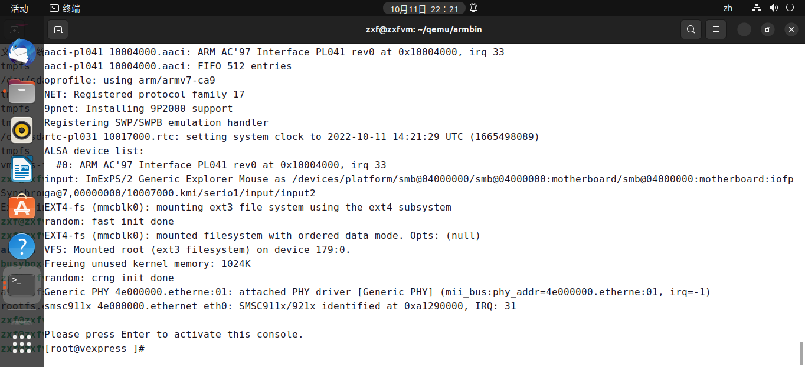
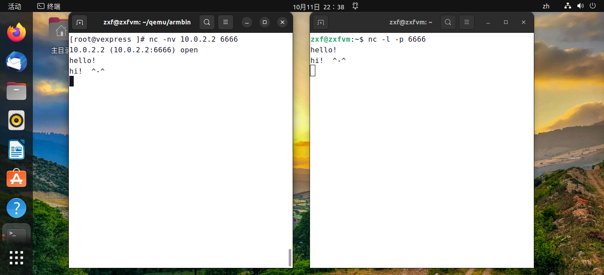

# 实验二 根文件系统实验

## 1. 实验目的

- 了解Linux系统下根文件系统结构
- 掌握根文件系统的搭建过程
- 掌握busybox等工具的使用方法

## 2. 实验内容

- 使用 busybox 生成文件系统中的命令部分，制作根文件系统。
- 分析根文件系统etc目录下重要配置文件的格式及语法，熟悉根文件系统的启动过程。

## 3. 实验环境

- 硬件：PC机
- 软件：Vmware Workstation +UBUNTU 22.04 LTS + ARM-LINUX交叉编译开发环境 + QEMU

## 4. 实验原理

### 4.1  嵌入式根文件系统

Linux下的根文件系统目录结构如下。

目录|习惯用法
---|---
bin|用户命令所在目录
dev|硬件设备文件及其它特殊文件
etc|系统配置文件，包括启动文件等
home|多用户主月录
lib|链接库文件目录
mnt|装配点,用于装配临时文件系统或其他的文件系统
opt|附加的软件套件目录
proc|虚拟文件系统，用来显示内核及进程信息
root|用户主目录
sbin|系统管理员命令目录
tmp|临时文件目录
usr|用户命令目录
var|监控程序和工具程序所存放的可变数据

对于用途单一的嵌入式系统，上边的一些用于多用户的目录可以省略，例如/home、/opt目录等。而/bin、/dev、/etc、/lib、/sbin和/usr目录，是几乎每个系统必备的目录，也是不可或缺的目录。

### 4.2  Busybox 工具集

小型的嵌入式 Linux 系统制作 root 根文件系统时有一个常用的利器：BusyBox。Busybox 是 Debian
GNU/Linux 的大名鼎鼎的 Bruce Perens 首先开发，使用在 Debian 的安装程序中。后来又有许多 Debian
developers 贡献力量，这其中尤推 busybox 目前的维护者 Erik Andersen，他患有癌症，可是却是一名优秀的自由软件开发者。

Busybox 编译出一个单个的独立执行程序，就叫做 busybox。但是它可以方便的进行配置，执行 ash shell的功能，以及几十个各种小应用程序的功能。这其中包括有一个迷您的 vi 编辑器，以及其他诸如 sed, ifconfig,mkdir, mount, ln, ls, echo, cat ... 等等这些都是一个正常的系统上必不可少的工具，但是如果我们把这些程序的原件拿过来的话，它们的体积加在一起，让人吃不消。可是 busybox 有全部的这么多功能，大小也不过100K 左右。而且，用户还可以根据自己的需要，决定到底要在 busybox 中编译进哪几个应用程序的功能。这样的话，busybox 的体积就可以进一步缩小了。Busybox 的具体配置和编译将在实验部分介绍。

## 5. 实验步骤

（1）下载busybox源代码：busybox-1.34.1.tar.bz2

（2）解压busybox-1.34.1.tar.bz2，进入busybox目录进行配置：

```bash
tar -xjvf busybox-1.34.1.tar.bz2
cd busybox-1.34.1
```

修改Makefile：vi Makefile
如下：

```makefile
ARCH ?= arm
CROSS_COMPILE=arm-linux-gnueabi-
```

配置：【make menuconfig中设置之后保存配置文件为.config】

```bash
make defconfig
make menuconfig
make
make install
```

可以看到_install 目录下生成了根文件系统常用的命令及工具，接下来的工作，可以根据需要将_install目录下生成的命令拷贝到根文件系统相应目录下。

（3）创建rootfs目录：

```bash
mkdir ../rootfs
```

（4）拷贝busybox命令：

```bash
cp _install/* -r ../rootfs/
mkdir -p ../rootfs/{lib,proc,sys,tmp,root,var,mnt}
```

（5）从工具链中拷贝运行库到lib下：

```bash
cp -P /usr/arm-linux-gnueabi/lib/* ../rootfs/lib/
rm ../rootfs/lib/*.a
```

将etc.tar.gz拷贝到rootfs的上层目录，解压，拷贝配置文件：

```bash
cd ..
tar -xzvf etc.tar.gz
cp etc rootfs/ -arf
```

（6）创建4个tty终端设备

c代表字符设备，4是主设备号，1~2~3~4是次设备号

```bash
mkdir -p rootfs/dev/
sudo mknod rootfs/dev/tty1 c 4 1
sudo mknod rootfs/dev/tty2 c 4 2
sudo mknod rootfs/dev/tty3 c 4 3
sudo mknod rootfs/dev/tty4 c 4 4
sudo mknod rootfs/dev/console c 5 1
sudo mknod rootfs/dev/null c 1 3
```

（7）生成镜像

```bash
dd if=/dev/zero of=rootfs.ext3 bs=1M count=32
```

（8）格式化生成ext3文件系统

```bash
mkfs.ext3 rootfs.ext3
```

（9）先挂载刚才的镜像然后将文件拷贝到镜像中

```bash
mkdir tmpfs
sudo mount -t ext3 rootfs.ext3 tmpfs/ -o loop
sudo cp -r rootfs/*  tmpfs/
sudo umount tmpfs
cp rootfs.ext3 ~/armbin
```

（10）测试运行

在~/armbin目录，建立脚本文件run2.sh：

```bash
cd armbin
vi run2.sh
```

内容如下：

```bash
qemu-system-arm -M vexpress-a9 -m 512M -dtb vexpress-v2p-ca9.dtb -kernel zImage -nographic -append "root=/dev/mmcblk0 rw console=ttyAMA0" -sd rootfs.ext3 -net nic -net user,hostfwd=tcp::8080-:8000
```

运行：

```bash
chmod +x run2.sh
./run2.sh
```



（11）挂载主机上的NFS共享目录【提前需要配置nfs，nfs路径及IP地址需要大家修改成自己的】

```bash
mount -t nfs -o nolock 10.0.2.2:/home/zxf/nfs /tmp
```

大家可以在NFS共享目录放入程序，在主机上交叉编译，再在QEMU虚拟机中运行测试。

（12）nc测试：

Ubuntu主机运行：`nc -l -p 6666`

qemu虚拟机中运行：`nc -nv 10.0.2.2 6666`
然后可以在Ubuntu主机或qemu虚拟机中输入任何文字信息，进行聊天测试，如下图：


