# 实验四 WEB服务器移植与模块驱动综合实验

## 1. 实验目的

- 了解常用的嵌入式Web服务器及其原理
- 掌握基本的CGI程序设计方法
- 熟悉字符设备驱动程序设计

## 2. 实验内容

- 编写CGI程序，调用多个设备模块驱动
- 在嵌入式Web服务器httpd上运行动态网页，运行测试CGI程序

## 3. 实验环境

- 硬件：PC机
- 软件：Vmware Workstation +UBUNTU 22.04 LTS + ARM-LINUX交叉编译开发环境 + QEMU

## 4. 实验原理

随着Internet技术的兴起，在嵌入式设备的管理与交互中，基于Web方式的应用成为目前的主流，这种程序结构也就是大家非常熟悉的B/S结构，即在嵌入式设备上运行一个支持脚本或CGI功能的Web服务器，能够生成动态页面，在用户端只需要通过Web浏览器就可以对嵌入式设备进行管理和监控，非常方便实用。本实验主要介绍这种应用的开发和移植工作。用户首先需要在嵌入式设备上成功移植支持脚本或CGI功能的Web服务器，如httpd，然后才能进行应用程序的开发。

(1)、嵌入式Web服务器的特点

嵌入式Web服务器和普通Web服务器一样，能够完成接收客户端请求、分析请求、响应请求、向客户端返回请求结果等任务。它的工作过程主要包括：

- 完成Web服务器的初始化工作，如创建环境变量、创建TCP套接字、绑定端口、开始侦听、进入循环结构，以及等待接收客户浏览器的连接请求；
- 当有客户端连接请求时，Web服务器负责接收客户端请求，并保存相关请求信息；
- 在接收到客户端的连接请求之后,分析客户端请求，解析出请求的方法、URL目标、可选的查询信息及表单信息，同时根据请求做出相应的处理；
- Web服务器完成相应处理后，向客户端浏览器发送响应信息，关闭与客户机的TCP连接。

(2)、嵌入式Web服务器移植

由于嵌入式设备资源一般都比较有限，并且也不需要能同时处理很多用户的请求，因此不会使用Linux下最常用的如Apache等服务器，而需要使用一些专门为嵌入式设备设计的Web服务器，这些Web服务器在存贮空间和运行时所占有的内存空间上都会非常适合于嵌入式应用场合。典型的嵌入式Web服务器有Boa（www.boa.org）和httpd等，它们和Apache等高性能的Web服务器主要的区别在于它们一般是单进程服务器，只有在完成一个用户请求后才能响应另一个用户的请求，而无法并发响应，但这在嵌入式设备的应用场合里已经足够了。

本实验采用busybox中的httpd作为实验的Web服务器。

(3)、CGI应用程序

CGI(Common Gateway Interface)是WWW技术中最重要的技术之一，有着不可替代的重要地位。CGI是外部应用程序（CGI程序）与WEB服务器之间的接口标准，是在CGI程序和Web服务器之间传递信息的过程。CGI规范允许Web服务器执行外部程序，并将它们的输出发送给Web浏览器，CGI将Web的一组简单的静态超媒体文档变成一个完整的新的交互式媒体。绝大多数的CGI程序被用来解释处理来自表单的输入信息，并在服务器产生相应的处理，或将相应的信息反馈给浏览器。CGI程序使网页具有交互功能。

CGI处理步骤：

- 通过Internet把用户请求送到web服务器。
- web服务器接收用户请求并交给CGI程序处理。
- CGI程序把处理结果传送给web服务器。
- web服务器把结果送回到用户。

CGI可以用任何一种语言编写，只要这种语言具有标准输入、输出和环境变量。

CGI工作原理：

- 浏览器通过HTML表单或超链接请求指向一个CGI应用程序的URL。
- 服务器收发到请求。
- 服务器执行指定CGI应用程序。
- CGI应用程序执行所需要的操作，通常是基于浏览者输入的内容。
- CGI应用程序把结果格式化为网络服务器和浏览器能够理解的文档（通常是HTML网页）。
- 网络服务器把结果返回到浏览器中。

## 5. 实验步骤

（1）busybox目前默认配置中已经选择了httpd，大家需要在busybox编译前再次确认，如下图：

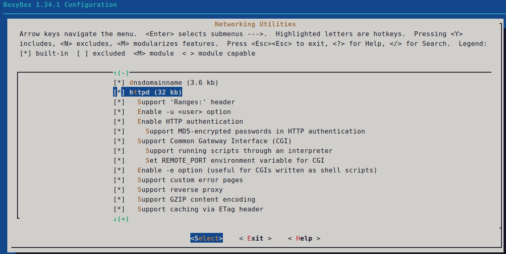

（2）httpd（WEB服务）测试

QEMU虚拟机图形化启动，在上面实验的armbin目录中建立启动脚本文件run3.sh，如下：

```bash
#run3.sh
qemu-system-arm -M vexpress-a9 -m 512M -dtb vexpress-v2p-ca9.dtb -kernel zImage -append "root=/dev/mmcblk0 rw console=ttyAMA0" -sd rootfs.ext3 -net nic -net user,hostfwd=tcp::8080-:8000 -display gtk,zoom-to-fit=true
```

添加run3.sh可执行权限：

```bash
chmod +x run3.sh
```

QEMU虚拟机图形化启动：

```bash
./run3.sh
```

QEMU虚拟机图形化启动后界面如下图，需要切换到serial0（串口）模式才能输入命令。

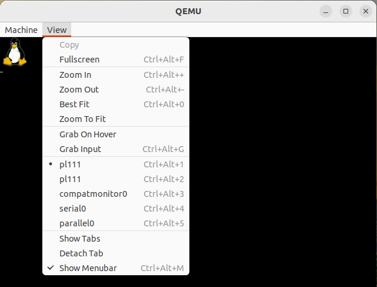
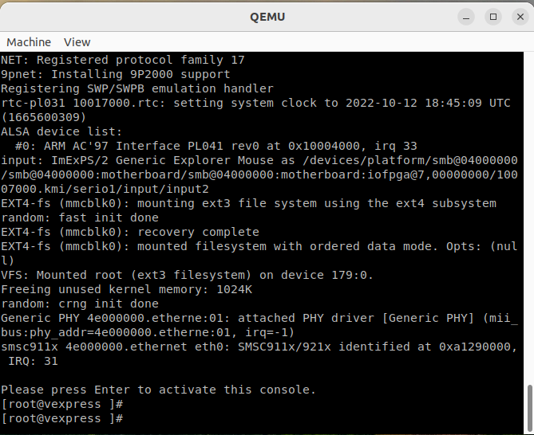

“pl111”菜单可以显示QEMU虚拟机的图形化屏幕，相当于LCD显示屏。

将老师提供的网页测试文件www目录拷贝到NFS共享目录中，然后修改网页文件index.html，将“测试者”改成自己的名字，在QEMU虚拟机中运行命令：

挂载NFS共享目录：

```bash
mount -t nfs -o nolock 10.0.2.2:/home/zxf/nfs /mnt/nfs
```

运行Web服务httpd：

```bash
httpd -p 8000 -h /mnt/nfs
```

之后打开Ubuntu中的浏览器访问QEMU虚拟机中的WEB服务（浏览器中输入地址：<http://192.168.254.142:8080>），如下图效果：

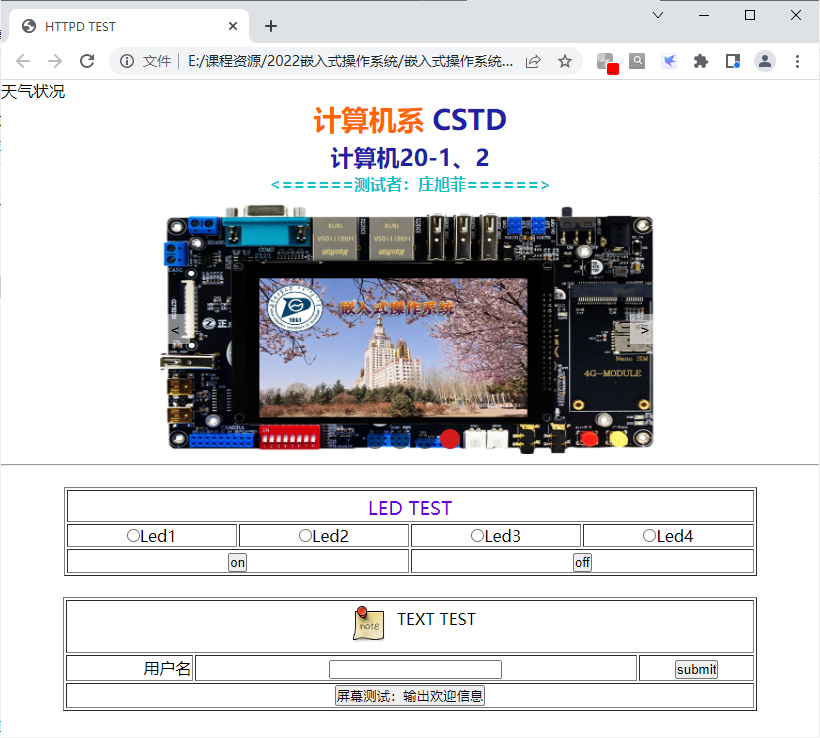

注意：“192.168.254.142”为Ubuntu本机IP地址，由于QEMU中已经设置了tcp转发功能，即访问“192.168.254.142”的8080端口会被转发到QEMU虚拟机中，则QEMU虚拟机中的httpd会响应，提供Web服务。

网站www目录结构如下图所示：

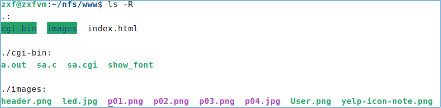

Index.html是网站主页；cgi-bin目录中是CGI程序，其中的sa.cgi是由sa.c交叉编译生成的可执行文件；show_font是QEMU虚拟机的LCD测试程序，单独运行，如：`./show_font`  可以显示如下图所示的界面（需要切换到“pl111”显示模式才能查看到）：

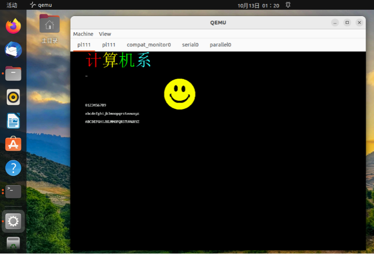

（13）请分析cgi-bin目录中的CGI程序sa.c的功能，要求修改sa.c，实现以下功能：

点击网页中的按钮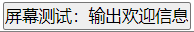可以在sa.c中调用实验三中的虚拟温湿度驱动程序，采集温湿度值并在网页左上角上显示出来；同时在QEMU虚拟机的LCD上显示如上图所示的LCD测试程序界面。最终效果如下图所示：

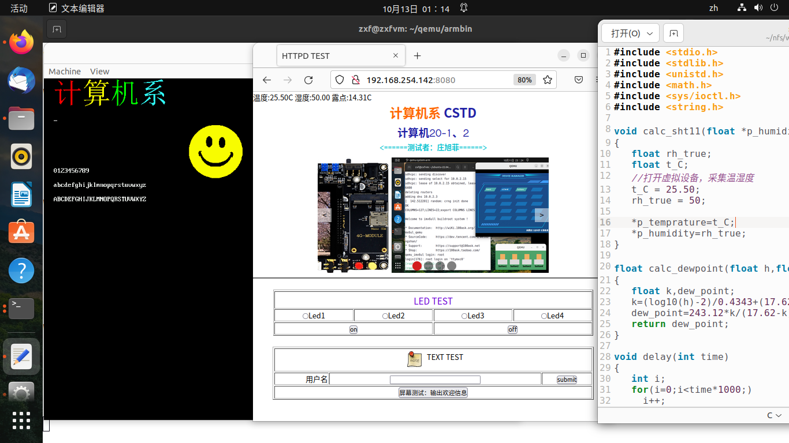

附1：

QEMU虚拟机的LCD测试程序说明：

1、LCD测试源程序在实验资料的fbtest目录中。

2、show_font.h中是点阵字库，show_font.c是主程序。

3、如果想要生成自己的字库，定制LCD输出的汉字，可以采用PCtoLCD2002软件生成汉字字模点阵，拷贝到show_font.h中，并在show_font.c中调用输出。

4、PCtoLCD2002软件设置及字模生成界面如下图所示：

5、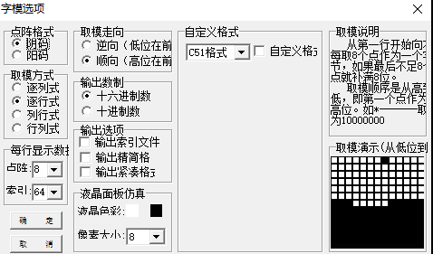

6、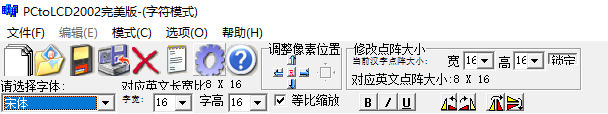

7、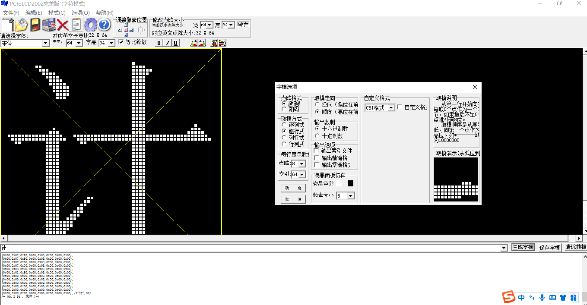
